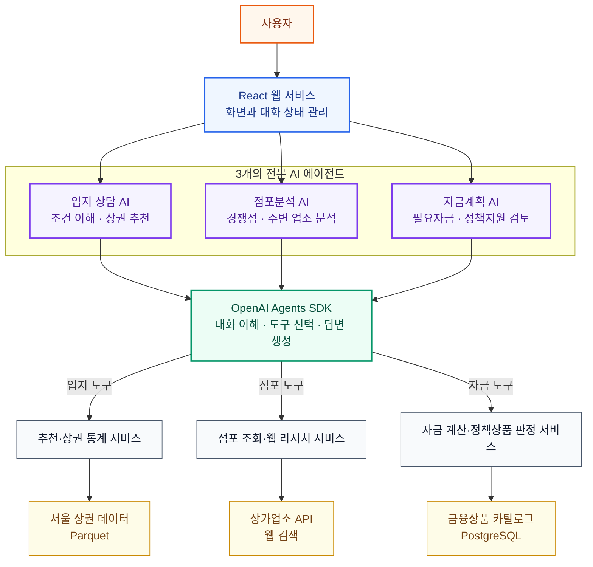

# AI 에이전트 아키텍처 — 발표용

> 하나의 서비스 안에서 입지 선정부터 점포 검토, 자금계획까지 3개의 전문 AI 에이전트가 역할을 나눠 지원한다.

## 전체 구조

## 발표 핵심 메시지

1. **역할 분리:** 입지·점포·자금계획을 각각 전문 에이전트가 담당한다.
2. **도구 기반 검증:** AI가 수치를 만들지 않고 검증된 서비스와 데이터를 조회한다.
3. **상태 격리:** 화면별 대화와 분석 범위를 분리해 다른 단계의 정보가 섞이지 않는다.

## 30초 설명

사용자가 웹에서 질문하면 현재 화면에 맞는 전문 에이전트가 선택됩니다. 각 에이전트는 OpenAI Agents SDK를 통해 필요한 도구를 호출하고, 추천·점포·금융 서비스가 실제 데이터로 결과를 계산합니다. 따라서 AI는 대화와 도구 선택을 담당하고, 핵심 수치와 판정은 결정론적 서비스가 담당합니다.
