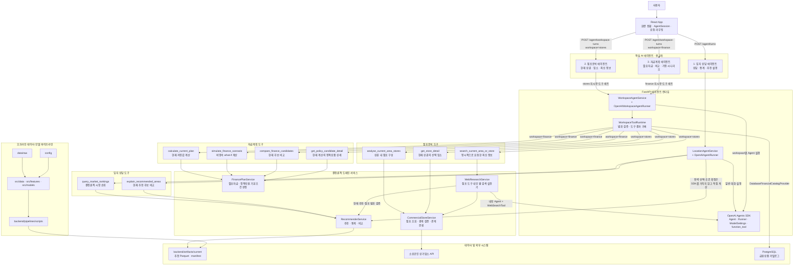
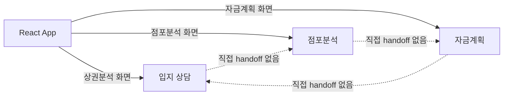
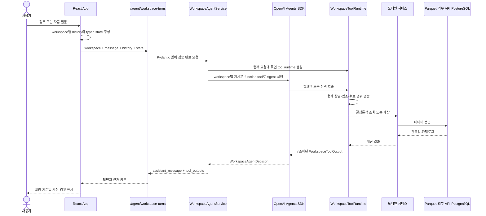

# AI 에이전트 중심 프로젝트 아키텍처

> 기준: `main` 브랜치 `5a411ed` (`devide ai agents`)

이 프로젝트의 사용자 대면 AI 에이전트는 **입지 상담, 점포분석, 자금계획의 3개**다. React가 현재 화면과 세션을 기준으로 에이전트를 선택하고, FastAPI 서비스가 OpenAI Agents SDK의 `Agent`, `Runner`, function tool을 실행한다.

## 전체 아키텍처

## 구조 해석

### 1. 에이전트는 3개다

| 에이전트 | 대화 상태 | SDK runner | 핵심 책임 |
|---|---|---|---|
| 입지 상담 | `session.history` | `OpenAIAgentRunner` | 자연어 조건 구조화, 일반 통계 조회, 추천 근거 설명 |
| 점포분석 | `workspaceChats.stores` | `OpenAIWorkspaceAgentRunner` | 현재 추천 상권 안의 점포 구성·업소 상세·명시적 웹 조사 |
| 자금계획 | `workspaceChats.finance` | `OpenAIWorkspaceAgentRunner` | 현재 임대 후보의 자금계획·가정 계산·비교·정책상품 상세 |

점포분석과 자금계획은 사용자 관점에서는 독립 에이전트지만, 서버에서는 `WorkspaceAgentService`와 `OpenAIWorkspaceAgentRunner` 구현을 공유한다. 요청의 `workspace` 값에 따라 지시문과 function tool 목록이 달라진다.

### 2. OpenAI Agents SDK와 직접 상호작용한다

세 에이전트 모두 자연어 응답을 만들 때 OpenAI Agents SDK를 사용한다.

- 입지 상담: `Agent(output_type=AgentDecision)`를 만들고 `Runner.run()`으로 구조화된 결정을 받는다.
- 점포분석·자금계획: workspace별 function tool을 장착한 `Agent(output_type=WorkspaceAgentDecision)`를 만들고 최대 4턴 실행한다.
- SDK tracing은 비활성화하고 `ModelSettings(store=False)`를 사용한다.
- `parallel_tool_calls=False`로 한 번에 하나의 도구 흐름만 실행한다.

예외적으로 입지 상담의 `select_scenario`와 `confirm_recommendation` 액션은 `LocationAgentService`가 먼저 처리해 SDK 없이 `RecommenderService`를 직접 실행한다.

### 3. SDK는 supervisor가 아니다

OpenAI Agents SDK가 세 에이전트 사이를 자동으로 handoff하지 않는다.

React의 `App.tsx`가 화면과 `AgentSession`을 보고 API를 선택한다. 서버는 요청에 포함된 history와 typed state만 사용하므로, 에이전트 간 컨텍스트 이동도 프런트엔드가 명시적으로 구성한다.

### 4. 도구가 수치와 근거를 만든다

LLM이 추천 점수, 점포 수, 자금 합계 또는 정책지원 판정을 임의로 계산하지 않는다. 에이전트는 function tool을 선택하고, 도구는 결정론적 서비스에서 값을 가져온다.

- 입지 도구는 배포된 추천 아티팩트만 조회한다.
- 점포 도구는 현재 추천 결과의 상권·업종 범위를 서버에서 다시 검증한다.
- 웹 검색은 사용자가 최신·외부 정보를 명시적으로 요청한 경우에만 실행한다.
- 자금 도구는 현재 화면에 전달된 최대 10개 후보만 계산한다.
- what-if 계산은 명시적 변경값만 덮어쓰며 브라우저의 저장값을 수정하지 않는다.
- 도구 결과는 `WorkspaceToolOutput`의 기준일, 가정, 경고와 함께 근거 카드로 표시된다.

## Workspace 에이전트 실행 흐름

## 상태와 경계

| 상태 | 위치 | 수명과 역할 |
|---|---|---|
| 입지 상담 history | `AgentSession.history` | `sessionStorage`에 저장, 최근 20개 요청 |
| 점포 대화 | `workspaceChats.stores` | 입지 대화와 분리, 최대 20개 보관·서버는 최근 12개 사용 |
| 자금 대화 | `workspaceChats.finance` | 다른 에이전트와 분리, 최대 20개 보관·서버는 최근 12개 사용 |
| workspace typed state | API 요청 본문 | 점포는 `StoreWorkspaceState`, 자금은 `FinanceWorkspaceState` |
| 도구 근거 | `workspaceToolOutputs` | React 메모리 상태, 상권·업종·선택 대상별 key로 격리 |
| 서버 대화 | 없음 | 매 요청마다 history와 state를 다시 전달 |

## 핵심 코드 위치

| 영역 | 파일 |
|---|---|
| 프런트 오케스트레이션·typed state 조립 | [`frontend/src/App.tsx`](../frontend/src/App.tsx) |
| 프런트 세션 모델 | [`frontend/src/features/agent/model.ts`](../frontend/src/features/agent/model.ts) |
| 에이전트 대화·근거 카드 UI | [`frontend/src/features/agent/WorkspaceAgentPanel.tsx`](../frontend/src/features/agent/WorkspaceAgentPanel.tsx) |
| 입지 상담 runner·도구·상태 전이 | [`backend/app/services/agent_service.py`](../backend/app/services/agent_service.py) |
| 점포·자금 runner와 도구 runtime | [`backend/app/services/workspace_agent_service.py`](../backend/app/services/workspace_agent_service.py) |
| 현재 추천·점포 범위를 검증하는 웹 검색 | [`backend/app/services/web_research_service.py`](../backend/app/services/web_research_service.py) |
| API 요청·typed workspace state | [`backend/app/schemas/agent.py`](../backend/app/schemas/agent.py) |
| 에이전트 API | [`backend/app/api/v1/agent.py`](../backend/app/api/v1/agent.py) |
| 서비스 생성과 의존성 연결 | [`backend/app/main.py`](../backend/app/main.py) |
| 추천·통계·비교 | [`backend/app/services/recommender_service.py`](../backend/app/services/recommender_service.py) |
| 점포 조회·분류 | [`backend/app/services/store_service.py`](../backend/app/services/store_service.py) |
| 자금·정책상품 판정 | [`backend/app/services/finance_service.py`](../backend/app/services/finance_service.py) |
| workspace 도구 계약 테스트 | [`backend/tests/test_workspace_agent.py`](../backend/tests/test_workspace_agent.py) |

## 현재 구조에서 혼동하기 쉬운 점

- `WorkspaceAgentService` 인스턴스는 하나지만 `stores`와 `finance`는 지시문, 도구, 대화 기록이 분리된 두 논리적 에이전트다.
- `WebResearchService`는 점포분석 에이전트의 function tool이 호출하는 내부 실행기다. Agents SDK의 `Agent`를 사용하지만 사용자 대면 핵심 에이전트 수에는 포함하지 않는다.
- 현재 코드에는 별도의 AI 매물 추출 서비스나 `/lease-candidates/extract` API가 없다. 임대 후보는 프런트엔드에서 입력·관리하고 자금계획 에이전트가 typed state로 전달받는다.
- 점포분석·자금계획 에이전트의 `tool_outputs`는 대화 텍스트와 분리된 구조화 근거다.
- 추천 엔진은 PostgreSQL을 사용하지 않는다. PostgreSQL은 금융상품 카탈로그 전용이다.
