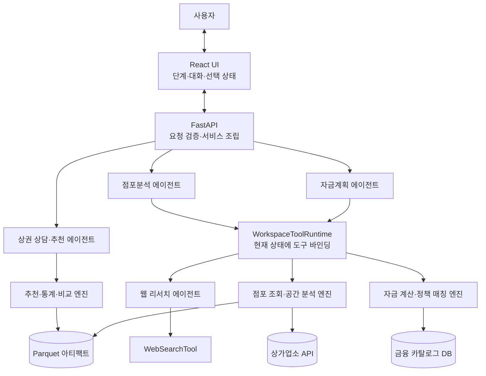
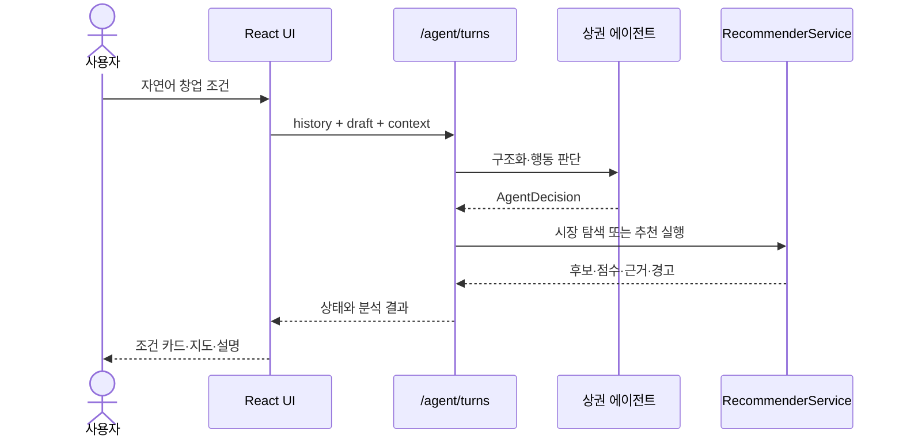
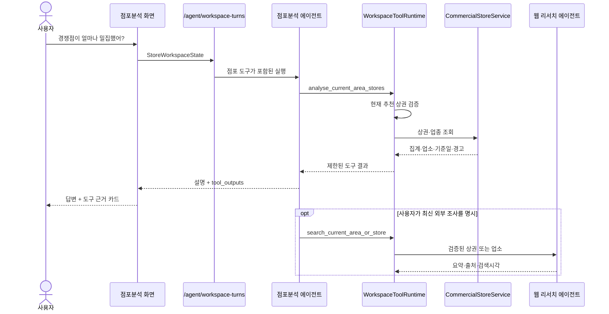
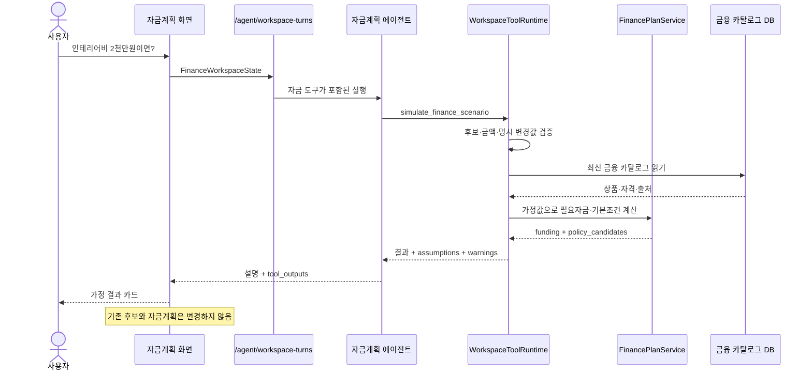

# AI 에이전트·멀티 에이전트 구조 개요 및 구현

> 기준: 현재 저장소의 런타임 구현  
> 대상 독자: 프로젝트 개발자, 아키텍처 검토자, 운영 담당자  
> 관련 문서: [카테고리별 AI 봇 역할 및 기술 구현](./ai-bot-roles-and-implementation.md), [대회 출품용 기술설명서 구성 가이드](./competition-technical-presentation-guide.md), [프로젝트 기술 명세](./project-technical-spec.md), [시스템 다이어그램](./system-diagrams.md)

## 1. 개요

이 서비스는 서울 창업 입지 탐색을 다음 세 단계로 나누고 각 단계에 전문 AI 에이전트를 배치한다.

1. **상권 분석**: 자연어 조건 구조화, 상권 통계 조회, 추천 시나리오와 근거 설명
2. **상권 내 점포분석**: 현재 추천 상권 내부 점포 조회, 경쟁·보완 관계 분석, 최신 외부 정보 조사
3. **자금계획**: 임대 후보의 필요자금 계산, 후보 비교, 가정 시나리오, 정책지원 기본조건 설명

이 구조는 하나의 범용 챗봇이 모든 업무를 처리하는 방식이 아니다. 업무 범위, 상태, 도구 권한이 서로 다른 전문 에이전트를 프런트엔드와 API 서비스가 단계별로 선택한다.

다만 현재 구현은 에이전트들이 서로 자유롭게 메시지를 보내고 작업을 위임하는 자율형 에이전트 네트워크도 아니다. 각 에이전트는 사용자의 현재 화면과 요청에 따라 독립적으로 실행되며, 단계 간 결과는 타입이 지정된 상태와 API 계약으로 전달된다. 따라서 가장 정확한 표현은 다음과 같다.

> **도메인별 전문 에이전트와 결정론적 분석 도구를 UI 워크플로가 조정하는 멀티 에이전트형 구조**

## 2. AI 에이전트의 정의

이 프로젝트에서 AI 에이전트는 다음 조건을 만족하는 런타임 구성요소다.

- 사용자의 자연어와 현재 상태를 함께 해석한다.
- 요청의 종류에 따라 허용된 도구 중 하나를 선택한다.
- 도구 실행 결과를 다시 입력으로 받아 최종 답변을 만든다.
- 역할 범위를 벗어난 작업은 거부하거나 다른 단계로 안내한다.
- 구조화 출력 또는 서버 검증을 통해 행동 범위를 제한한다.

반대로 다음 구성요소는 중요하지만 AI 에이전트 자체는 아니다.

| 구성요소 | 분류 | 이유 |
|---|---|---|
| `RecommenderService` | 결정론적 분석 엔진 | 동일한 입력에 동일한 추천·통계·비교 결과를 계산 |
| `CommercialStoreService` | 데이터 조회·공간 분석 도구 | API 조회, Point-in-Polygon, 분류와 집계를 수행 |
| `FinancePlanService` | 계산·규칙 엔진 | 필요자금 공식과 금융상품 기본조건을 재현 가능하게 평가 |
| `ParquetCommercialCostProvider` | 데이터 제공자 | 정적 임대시세로 환산임대료를 계산 |
| 금융 카탈로그 | 데이터·규칙 저장소 | 상품, 기관, 혜택, 자격 규칙과 공식 출처를 제공 |

LLM은 숫자나 순위를 직접 만들어내지 않는다. 에이전트는 자연어 이해와 도구 선택, 결과 설명을 담당하고 실제 사실값은 위 엔진들이 제공한다.

## 3. 전체 멀티 에이전트 구조



### 3.1 오케스트레이션 방식

현재 오케스트레이터는 별도의 상위 LLM이 아니라 **프런트엔드 단계 상태와 FastAPI 라우팅**이다.

```text
상권분석 화면
  → POST /api/v1/agent/turns
  → LocationAgentService

점포분석 화면
  → POST /api/v1/agent/workspace-turns, workspace=stores
  → WorkspaceAgentService
  → 점포 도구만 제공

자금계획 화면
  → POST /api/v1/agent/workspace-turns, workspace=finance
  → WorkspaceAgentService
  → 자금 도구만 제공

명시적 최신 정보 조사
  → 점포분석 도구 또는 POST /api/v1/agent/web-research
  → WebResearchService
```

이 방식의 장점은 에이전트가 다른 단계의 권한을 자동으로 획득하지 못한다는 점이다. 예를 들어 점포분석 에이전트에는 자금계획 도구가 전달되지 않으며, 자금계획 에이전트에는 상권 재추천 도구가 전달되지 않는다.

### 3.2 에이전트 간 상태 전달

에이전트 간 직접 메시지 전달은 사용하지 않는다. 앞 단계의 결과 중 다음 단계에 필요한 값만 브라우저 상태와 API 요청 스키마로 전달한다.

| 전환 | 전달되는 핵심 상태 |
|---|---|
| 상권 분석 → 점포분석 | 현재 추천 요청, 선택 상권 코드, 업종 코드, 창업자 컨텍스트 |
| 점포분석 → 자금계획 | 선택 상권, 사용자가 등록한 임대 후보, 후보별 추가 비용·신청자 조건 |
| 점포분석 → 웹 리서치 | 현재 추천 요청, 검증된 상권 또는 업소 ID, 창업자 컨텍스트 |

## 4. 에이전트별 책임과 구현

### 4.1 상권 상담·추천 에이전트

구현 중심은 `OpenAIAgentRunner`와 `LocationAgentService`다.

| 항목 | 내용 |
|---|---|
| 역할 | 자연어 조건 구조화, 통계 질문 분기, 추천 후보 설명 |
| 구조화 출력 | `AgentDecision` |
| 주요 상태 | `RecommendationDraft`, `FounderContext`, `AgentAssumption` |
| 함수 도구 | `query_market_rankings`, `recommend_confirmed_areas`, `explain_recommended_areas` |
| 결정론적 실행 | `RecommenderService` |

사용자가 말한 업종, 지역, 고객층, 시간대, 중요도, 예산과 임대조건은 `RecommendationDraft`로 구조화된다. 사용자가 명시하지 않은 선택 조건은 임의로 추론해 점수에 넣지 않는다.

추천 확인과 전략 선택은 서비스 계층에서 결정론적 추천 엔진을 직접 실행한다. 추천 후 특정 후보의 이유나 차이를 물으면 현재 추천 결과에 포함된 코드만 비교 도구에 전달한다.



### 4.2 점포분석 에이전트

점포분석 에이전트는 `WorkspaceAgentService`가 `workspace=stores`일 때 생성한다. 서버는 `StoreWorkspaceState`로 현재 상권과 업종을 검증하고 다음 도구만 제공한다.

| 도구 | 기능 | 권한 제한 |
|---|---|---|
| `analyse_current_area_stores` | 점포 구성, 경쟁·보완 관계, 밀도, 검색 결과 조회 | 현재 추천 결과에 포함된 상권만 허용 |
| `get_store_detail` | 개별 업소 주소·업종·관계 분류 확인 | 현재 상권 조회 결과의 업소 ID만 허용 |
| `search_current_area_or_store` | 상권 또는 업소의 최신 외부 정보 조사 | 사용자가 최신·외부 검색을 명시한 경우만 허용 |

점포분석은 상가업소 API 결과를 상권 Polygon/MultiPolygon으로 다시 필터링한다. 점포 수와 관계 분류는 관측 정보이며 성공 가능성이나 인과관계를 뜻하지 않는다.



### 4.3 자금계획 에이전트

자금계획 에이전트는 `WorkspaceAgentService`가 `workspace=finance`일 때 생성한다. `FinanceWorkspaceState`에는 현재 상권과 최대 10개의 임대 후보가 포함되며, 모든 후보의 `area_code`가 현재 상권과 일치해야 한다.

| 도구 | 기능 | 상태 변경 여부 |
|---|---|---|
| `calculate_current_plan` | 현재 입력값으로 첫해 필요자금과 정책 후보 계산 | 변경 없음 |
| `simulate_finance_scenario` | 사용자가 명시한 값만 덮어쓴 가정 계산 | 저장값 변경 없음 |
| `compare_finance_candidates` | 현재 상권의 임대 후보를 같은 기준으로 비교 | 변경 없음 |
| `get_policy_candidate_detail` | 현재 계산에 포함된 정책 후보의 공식 조건 조회 | 변경 없음 |

가정 시나리오는 보증금, 월세, 관리비, 권리금, 추가 창업비, 자기자본과 신청자 조건을 일회성으로 바꿀 수 있다. 사용자가 말하지 않은 값은 현재 입력값을 유지하고, 실제로 바꾼 값은 `assumptions`에 기록한다.

관리비나 권리금이 `null`이면 0원으로 간주하지 않는다. 계산을 중단하고 사용자에게 확인이 필요하다고 알린다. 정책지원 결과는 승인 여부가 아니라 공개 기본조건에 대한 `basic_fit`, `needs_review`, `not_eligible` 분류다.



### 4.4 웹 리서치 에이전트

웹 리서치 에이전트는 OpenAI Agents SDK의 `WebSearchTool`을 사용한다. 웹 검색 도구 호출은 필수이며, 검색 응답에서 유효한 HTTP(S) 출처를 수집하지 못하면 성공 결과를 반환하지 않는다.

- 상권 조사: 최근 개발, 교통, 행사, 규제, 상권 변화
- 업소 조사: 상호와 주소가 일치하는 공식 홈페이지, 보도, 신뢰 가능한 디렉터리
- 금지: 리뷰·평점 임의 합산, 동명이업소 단정, 미래 매출 예측

웹 리서치 결과에는 `sources`, `searched_at`, `warnings`가 포함된다. 점포분석 에이전트 안에서 호출할 수도 있고 별도 `/agent/web-research` API로 실행할 수도 있다.

## 5. 워크스페이스 도구 런타임

`WorkspaceToolRuntime`은 점포분석·자금계획 에이전트와 실제 서비스 사이의 권한 경계다.

### 5.1 런타임 생성

매 요청마다 다음 값으로 새 런타임을 만든다.

```text
WorkspaceToolRuntime
├─ 검증된 WorkspaceAgentRequest
├─ CommercialStoreService
├─ WebResearchService
├─ FinancePlanService
├─ FinancialCatalogProvider
├─ 요청 내 점포·카탈로그 캐시
└─ 누적 WorkspaceToolOutput
```

런타임은 사용자 상태를 그대로 신뢰하지 않는다. 도구 실행 전에 현재 추천 결과, 상권, 업종, 업소 ID, 임대 후보 ID와 상권 코드를 다시 검증한다.

### 5.2 도구 결과 계약

모든 도구 실행은 `WorkspaceToolOutput`으로 기록된다.

```text
WorkspaceToolOutput
├─ kind: 실행 결과 종류
├─ status: succeeded | failed
├─ title
├─ payload: 결정론적 도구 결과
├─ as_of: 기준월·확인일·검색시각
├─ assumptions: 일회성 가정값
└─ warnings: 누락·fallback·한계·실패 원인
```

`WorkspaceAgentResponse`는 `assistant_message`와 `tool_outputs`를 함께 반환한다. 프런트엔드는 AI 문장만 표시하지 않고 점포 수, 필요자금, 출처, 가정과 경고를 별도 근거 카드로 렌더링한다.

모델 컨텍스트에는 전체 원천 데이터를 무제한 전달하지 않는다. 점포 목록은 최대 10개, 정책 후보는 우선순위 상위 5개로 제한해 전달하고, 구조화 응답에는 사용자 확인에 필요한 결정론적 결과를 보존한다.

## 6. API와 상태 계약

### 6.1 주요 API

| API | 담당 에이전트·기능 |
|---|---|
| `POST /api/v1/agent/turns` | 상권 상담, 통계 조회, 추천 근거 설명 |
| `POST /api/v1/agent/workspace-turns` | 점포분석 또는 자금계획 도구형 에이전트 |
| `POST /api/v1/agent/web-research` | 별도 상권·업소 웹 리서치 |
| `POST /api/v1/recommendations` | AI를 통하지 않는 직접 추천 |
| `GET /api/v1/areas/{area_code}/stores` | AI를 통하지 않는 직접 점포 조회 |
| `POST /api/v1/finance/plans` | AI를 통하지 않는 직접 자금계획 계산 |

### 6.2 워크스페이스 요청

```json
{
  "workspace": "stores",
  "message": "경쟁점이 얼마나 밀집했어?",
  "history": [],
  "state": {
    "kind": "stores",
    "area_code": "...",
    "industry_code": "...",
    "selected_store_id": null,
    "active_recommendation_request": {
      "industry_code": "CS100001"
    },
    "founder_context": {}
  }
}
```

`workspace`와 `state.kind`는 일치해야 한다. `state`는 `StoreWorkspaceState`와 `FinanceWorkspaceState`의 Pydantic discriminated union으로 검증한다.

### 6.3 워크스페이스 응답

```json
{
  "request_id": "...",
  "workspace": "stores",
  "assistant_message": "현재 상권의 경쟁점은 ...",
  "tool_outputs": [
    {
      "kind": "store_summary",
      "status": "succeeded",
      "title": "점포 구성",
      "payload": {},
      "as_of": "202607",
      "assumptions": [],
      "warnings": []
    }
  ]
}
```

## 7. 안전성과 신뢰성

### 7.1 권한 격리

- 에이전트에는 현재 워크스페이스에 필요한 도구만 전달한다.
- 점포 도구의 상권·업종은 현재 상태에 바인딩하며 모델이 임의 변경할 수 없다.
- 자금 도구는 현재 상권에 포함된 임대 후보만 선택할 수 있다.
- 점포·자금 에이전트는 저장, 삭제, 신청, 송금 같은 변경 작업을 수행하지 않는다.
- 가정 계산은 응답에만 존재하며 브라우저 저장 상태를 변경하지 않는다.

### 7.2 데이터 신뢰성

- 추천 점수, 점포 집계, 필요자금과 정책 매칭은 서버 함수가 계산한다.
- 관측값, 추정값, 모델 점수를 구분한다.
- 기준월, 공식 출처 확인일, 웹 검색시각을 함께 반환한다.
- 외부 점포 API 장애 시 허용 기간 내 stale 캐시만 경고와 함께 사용한다.
- 미확인 비용과 0원을 구분한다.

### 7.3 LLM 안전장치

- 프롬프트는 대화·상태 JSON을 신뢰할 수 없는 사용자 데이터로 취급한다.
- 추천 에이전트는 Pydantic 구조화 출력인 `AgentDecision`을 사용한다.
- 워크스페이스 에이전트는 `WorkspaceAgentDecision`의 `answer_basis`를 사용하며 데이터 답변에는 도구 실행이 필요하다.
- Agents SDK의 응답 저장을 끄고 `store=False`를 사용한다.
- SDK 추적을 비활성화한다.
- 도구 실패 시 원천 예외나 인증정보를 노출하지 않고 구조화된 실패 근거를 반환한다.

## 8. 운영 설정과 장애 처리

| 설정 | 기본값 | 용도 |
|---|---:|---|
| `AGENT_TIMEOUT_SECONDS` | 30초 | 상권 상담 에이전트 제한 시간 |
| `WORKSPACE_AGENT_TIMEOUT_SECONDS` | 60초 | 점포·자금 에이전트 전체 제한 시간 |
| `WEB_RESEARCH_TIMEOUT_SECONDS` | 45초 | 웹 검색 제한 시간 |
| `AGENT_MAX_TURNS` | 4 | 상권 에이전트 최대 실행 턴 |
| `AGENT_RATE_LIMIT_PER_MINUTE` | 10 | 에이전트 API 분당 요청 제한 |
| `STORE_API_TIMEOUT_SECONDS` | 15초 | 상가업소 API 제한 시간 |
| `STORE_CACHE_TTL_SECONDS` | 86,400초 | 점포 신선 캐시 |
| `STORE_STALE_TTL_SECONDS` | 604,800초 | 점포 stale 캐시 허용 기간 |

주요 장애 처리는 다음과 같다.

| 장애 | 동작 |
|---|---|
| OpenAI 키 또는 SDK 없음 | AI API만 사용 불가, 직접 추천·점포·자금 API 유지 |
| 점포 API 갱신 실패 | 유효한 stale 캐시가 있으면 경고 후 반환 |
| 웹 검색 출처 없음 | 성공 응답 생성 중단 |
| 금융 DB 접근 실패 | 자금 도구 실패 근거 반환, 값을 추측하지 않음 |
| 워크스페이스 시간 초과 | 504 계열 에이전트 시간 초과 응답 |
| 잘못된 상권·업소·후보 | 서버 스키마 또는 도구 범위 검증에서 거부 |

모든 API 응답은 `request_id`를 포함하고 응답 헤더에는 처리 시간이 기록된다.

## 9. 테스트 전략

에이전트 테스트는 LLM의 문장 자체보다 도구 선택 경계와 결정론적 결과를 중심으로 구성한다.

- 워크스페이스와 `state.kind` 불일치 거부
- 현재 추천 결과 밖 상권 조회 거부
- 현재 상권 밖 임대 후보 거부
- 점포 목록·정책 후보의 모델 입력 개수 제한
- 일반 점포 질문에서 웹 검색 차단
- 명시적 최신 정보 요청에서만 웹 검색 실행
- 현재 자금계획과 `/finance/plans` 계산 결과 일치
- 가정 계산 후 원본 상태 불변
- 미확인 관리비·권리금을 0원으로 처리하지 않음
- 후보 비교와 정책 상세가 현재 후보·현재 계산 범위를 벗어나지 않음
- 응답의 `tool_outputs`와 프런트 근거 카드 렌더링
- OpenAI Agents SDK 함수 도구 스키마 생성 검증

## 10. 확장 방향

### 10.1 현재 구조에서 에이전트 추가

새 전문 에이전트는 다음 순서로 추가한다.

1. 책임과 금지 범위를 먼저 정의한다.
2. 전용 `state` 스키마를 만든다.
3. 재현 가능한 읽기·계산 서비스를 먼저 구현한다.
4. 현재 상태에 바인딩된 함수 도구를 제공한다.
5. `WorkspaceToolOutput` 종류와 근거 카드를 추가한다.
6. 범위 이탈, 실패, 비저장성을 테스트한다.

### 10.2 진짜 에이전트 간 handoff가 필요한 경우

다음 조건이 생기기 전까지 현재의 UI 오케스트레이션을 유지한다.

- 한 요청을 여러 전문 에이전트가 순차적으로 처리해야 한다.
- 중간 결과에 따라 다음 에이전트를 동적으로 선택해야 한다.
- 장시간 작업의 재개, 취소, 진행 상태 저장이 필요하다.
- 에이전트 간 공유 작업 메모리와 감사 로그가 필요하다.

handoff를 도입하더라도 자유 형식 대화를 그대로 전달하지 않는다. `task_id`, 요청 스키마, 산출물 스키마, 허용 도구, 시간·비용 한도와 사용자 확인 지점을 명시하는 상위 오케스트레이터를 둔다.

### 10.3 변경 도구를 추가하는 경우

현재 에이전트는 읽기·계산 전용이다. 후보 저장·삭제, 입력 수정, 금융 신청 같은 변경 도구를 추가할 때는 다음 절차를 강제한다.

```text
AI가 변경안 생성
→ 서버가 구조화된 diff와 영향 범위 계산
→ UI가 사용자에게 변경 전후 표시
→ 사용자 명시 확인
→ 서버가 1회성 확인 토큰 검증
→ 변경 실행 및 감사 로그 기록
```

AI의 자연어 답변만으로 외부 상태를 변경해서는 안 된다.

## 11. 주요 코드 위치

| 목적 | 코드 |
|---|---|
| 상권 상담·추천 에이전트 | [backend/app/services/agent_service.py](../backend/app/services/agent_service.py) |
| 점포·자금 에이전트와 도구 런타임 | [backend/app/services/workspace_agent_service.py](../backend/app/services/workspace_agent_service.py) |
| 웹 리서치 에이전트 | [backend/app/services/web_research_service.py](../backend/app/services/web_research_service.py) |
| 에이전트 상태·응답 스키마 | [backend/app/schemas/agent.py](../backend/app/schemas/agent.py) |
| API 라우팅 | [backend/app/api/v1/agent.py](../backend/app/api/v1/agent.py) |
| 프런트 상태·단계 오케스트레이션 | [frontend/src/App.tsx](../frontend/src/App.tsx) |
| 도구 실행 근거 카드 | [frontend/src/features/agent/WorkspaceAgentPanel.tsx](../frontend/src/features/agent/WorkspaceAgentPanel.tsx) |
