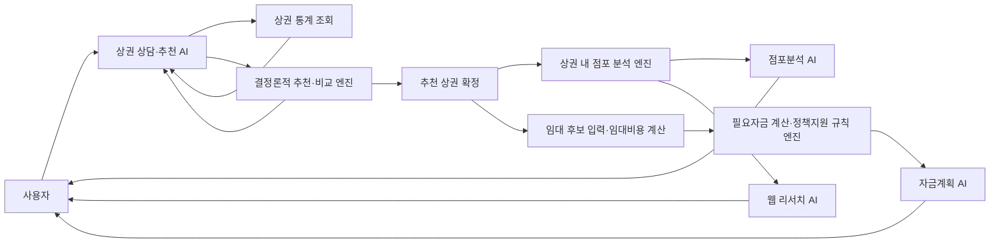

# 카테고리별 AI 봇 역할 및 기술 구현

> 대상 카테고리: **상권 분석 → 상권 내 입지분석 → 자금계획**  
> 기준: 현재 저장소에 구현된 기능과 API  
> 문서 목적: 각 단계에서 AI가 맡는 판단, 결정론적 엔진이 맡는 계산, 단계 간 데이터 계약을 명확히 정의한다.

전체 에이전트 구성과 오케스트레이션 방식은 [AI 에이전트·멀티 에이전트 구조 개요 및 구현](./ai-agent-multi-agent-architecture.md)을 참고한다.

## 1. 설계 원칙

이 서비스에서 “AI 봇”은 모든 값을 스스로 계산하는 자율 에이전트가 아니다. 사용자와 대화하며 의도를 구조화하고, 허용된 분석 도구를 호출하고, 도구가 반환한 근거를 설명하는 역할을 맡는다. 점수·순위·점포 수·비용·정책지원 기본조건 판정은 재현 가능한 Python 서비스와 데이터 아티팩트가 담당한다.

따라서 역할은 다음과 같이 분리한다.

| 계층 | 책임 | 금지 사항 |
|---|---|---|
| 대화형 AI | 자연어 이해, 조건 구조화, 적절한 도구 선택, 결과 요약, 후속 질문 응답 | 점수·금액·통계를 추측하거나 승인·매출을 보장하지 않음 |
| 분석·규칙 엔진 | 조회, 필터링, 집계, 추천 점수, 비용 계산, 정책 기본조건 매칭 | 자연어를 임의로 해석하지 않음 |
| 데이터 계층 | 정적 Parquet, 상가업소 API, 금융상품 카탈로그, 출처 메타데이터 제공 | 출처·기준일이 없는 값을 운영 결과로 사용하지 않음 |
| 프런트엔드 | 사용자 확인, 분석 상태 유지, 단계 이동, 지도·표·비용 폼 표시 | AI 답변만으로 확정 조건이나 금액을 조용히 변경하지 않음 |

이 문서에서 여러 “봇”은 업무상 역할을 의미한다. 현재 배포 단위가 각각 독립 마이크로서비스라는 뜻은 아니다. 예를 들어 점포분석 AI와 자금계획 AI는 동일한 `WorkspaceAgentService`를 사용하되, 워크스페이스별 지시문과 컨텍스트로 역할을 격리한다.

## 2. 전체 업무 흐름



핵심 데이터 흐름은 다음과 같다.

1. 상권 분석 AI가 대화에서 업종과 선택 조건을 `RecommendationDraft`로 구조화한다.
2. 추천 엔진이 동일 입력에 항상 동일한 후보·점수·근거를 반환한다.
3. 선택한 상권 코드와 업종 코드를 상권 내 입지분석 단계로 넘긴다.
4. 상권 경계 안의 실제 업소를 조회·분류하고, 필요할 때 최신 외부 정보를 별도로 검색한다.
5. 선택 상권의 임대 후보와 추가 비용·자기자본·신청자 조건을 자금계획 단계로 넘긴다.
6. 자금계획 AI가 계산·비교 도구를 직접 호출하고, 검증된 결과와 적용 가정을 설명한다.

---

## 3. 상권 분석 카테고리

### 3.1 봇별 역할

| 봇/도구 역할 | 사용자 가치 | 입력 | 출력 | 구현 방식 |
|---|---|---|---|---|
| 상권 상담·오케스트레이션 AI | 자연어 창업 조건을 분석 가능한 값으로 바꾸고 다음 행동을 결정 | 대화, 현재 초안, 창업자 컨텍스트, 가정, 메타데이터 | `AgentDecision`, 수정된 초안, 응답 메시지 | OpenAI Agents SDK + Pydantic 구조화 출력 |
| 상권 통계 조회 도구 | “매출 높은 상권”, “폐업률 낮은 업종” 같은 사실 조회 | 집계 단위, 지표, 정렬, 지역·업종 필터 | 순위, 평균·중앙값·표준편차, 기준 기간 | `RecommenderService.lookup_market_rankings` |
| 상권 추천·시나리오 엔진 | 조건 충실형·성장 기회형·안정성 우선형 후보 비교 | 확정된 `RecommendationRequest` | 후보, 점수, 진단, 시나리오, 트레이드오프 | Parquet 기반 결정론적 Python 엔진 |
| 추천 근거 설명 도구 | 추천 이유, 위험요인, 후보 간 차이를 관측값으로 설명 | 현재 추천 요청과 후보 코드 | 비교 지표, 벤치마크, 신뢰도, 임대료 추정 | `compare`, `recommendation_evidence_context` |

### 3.2 상권 상담·추천 AI

사용자에게 보이는 주 에이전트다. 구현은 [agent_service.py](../backend/app/services/agent_service.py)의 `OpenAIAgentRunner`와 `LocationAgentService`에 있다.

주요 책임은 다음과 같다.

- 자연어에서 업종, 지역, 고객층, 시간대, 인구·시설 선호, 위험 선호, 예산과 임대조건을 구조화한다.
- 사용자가 명확히 말한 조건만 초안에 반영하고, 생략된 선택 조건은 제한 없음으로 유지한다.
- 업종이 없거나 임대료 추정에 필요한 면적·층 정보가 불완전할 때만 추가 질문한다.
- 현재 조건으로 후보군과 세 전략 시나리오를 탐색한다.
- 추천 후 질문은 새 추천으로 처리하지 않고 현재 결과의 비교·근거 도구로 답한다.
- 일반 통계 질문은 추천을 실행하지 않고 통계 조회 도구로 분기한다.

대화 상태는 서버 세션에 숨겨두지 않고 매 요청에 명시적으로 전달한다.

```text
AgentTurnRequest
├─ action: message | select_scenario | confirm_recommendation
├─ history: 최근 대화
├─ draft: 점수 계산에 쓰이는 구조화 조건
├─ context: 설명용 창업자 맥락
├─ assumptions: 추론/확인/거절된 가정
├─ selected_scenario_id, analysis_revision
└─ active_recommendation_request 또는 active_market_lookup_query
```

`draft`와 `context`를 분리하는 이유는 “젊은 감성의 매장” 같은 서술을 근거 없이 연령 가중치로 바꾸지 않기 위해서다. 실제 점수에 들어가는 값은 `draft`에 명시된 필드뿐이다.

### 3.3 결정론적 추천 구현

추천의 계산 경로는 다음과 같다.

```text
RecommendationDraft
  → Pydantic 코드·범위 검증
  → 지역/상권유형/신뢰도 하드 필터
  → 사용자 조건 적합도 계산
  → 업종 성과 근거 점수 계산
  → 데이터 신뢰도 보정
  → 임대조건이 있으면 임대료 및 예산 적합도 반영
  → 최종 순위·긍정/부정 근거·경고 생성
```

추천 엔진의 데이터는 `backend/artifacts/current/` 아래의 다음 정적 아티팩트를 사용한다.

- `area_recommendation_index.parquet`: 상권 구조와 추천용 특징
- `area_industry_evidence.parquet`: 상권×업종 성과 근거
- `area_boundaries.parquet`, `district_boundaries.parquet`: 지도 경계
- `commercial_rent_observations.parquet`: 행정동/자치구 기준 환산임대시세
- `manifest.json`: 버전과 파일 체크섬

추천 점수는 LLM이 생성하지 않는다. `confirm_recommendation`과 전략 선택은 서버의 `RecommenderService.recommend_with_report`가 실행하며, 응답에는 후보군 중앙값 대비 차이, 데이터 기간, 경쟁 지표 기준 기간, 신뢰도 등급과 경고가 함께 포함된다. 상세 산식과 데이터 파이프라인은 [project-technical-spec.md](./project-technical-spec.md)를 참고한다.

### 3.4 API와 화면 연결

| API | 용도 |
|---|---|
| `POST /api/v1/agent/turns` | 자연어 상담, 통계 조회, 시나리오 선택, 추천 근거 설명 |
| `POST /api/v1/recommendations` | AI를 통하지 않는 직접 추천 실행 |
| `POST /api/v1/market-geographies` | 통계 결과의 지도 경계 조회 |
| `POST /api/v1/commercial-costs/lease-plan` | 선택 상권의 임대시세와 1차 임차자금 계산 |

상권 통계 순위 조회는 현재 별도 공개 엔드포인트가 아니라 `POST /api/v1/agent/turns` 안에서 에이전트가 `query_market_rankings` 함수 도구를 호출하는 방식으로 제공된다.

프런트엔드의 `AgentPanel`은 상담·조건 확인을 담당하고, `AgentCommandCenter`와 분석 패널은 탐색 단계, 시나리오, 트레이드오프와 결과를 보여준다. 사용자가 추천을 확인한 뒤 상권 코드를 선택하면 다음 단계로 이동한다.

### 3.5 답변 정책

- 매출, 점포 수, 인구, 임대료, 점수는 도구 결과만 인용한다.
- 경쟁 강도 내부 점수를 직접 노출하지 않고 최근 점포 수와 동종업종 밀도를 설명한다.
- 아파트 평균 시세는 주거용 참고치이며 상가 가격으로 표현하지 않는다.
- 관측 데이터, 모델 점수, 추정 임대료를 문장에서 구분한다.
- 미래 매출이나 성공 가능성을 보장하지 않는다.

---

## 4. 상권 내 입지분석 카테고리

### 4.1 현재 분석 범위

현재 구현은 **추천된 상권 경계 내부의 점포 구성과 개별 업소 정보 분석**이다. 필지별 유동 동선, 가시성, 전면 폭, 주차, 건물 상태, 실제 공실·매물 조건을 평가하는 미시 입지 모델은 아직 포함하지 않는다. 따라서 화면과 AI 답변에서 “이 점포가 성공하기 좋은 자리”라고 단정하지 않고, “선택 상권 안에서 경쟁점과 보완업종이 어떻게 구성돼 있는지”를 설명한다.

### 4.2 봇별 역할

| 봇/도구 역할 | 사용자 가치 | 입력 | 출력 | 구현 방식 |
|---|---|---|---|---|
| 상권 내 점포 분석 엔진 | 선택 상권 안의 업소만 정확히 추출하고 관계별 밀도를 계산 | 상권 코드, 업종 코드, 상권 Polygon | 업소 목록, 경쟁/보완/생활/기타 분류, 밀도와 상위 업종 | 소상공인시장진흥공단 상가업소 API + Shapely 공간 필터 |
| 점포분석 AI | 현재 상권의 점포 도구를 호출하고 결과를 쉬운 말로 해석 | 선택 상권·업종·업소 식별자 | 2~5문장 답변과 구조화된 도구 근거 | 워크스페이스 전용 LLM + 함수 도구 |
| 최신 정보 웹 리서치 AI | 정적·공공 데이터에 없는 최근 이슈를 출처와 함께 보완 | 현재 추천 상권 또는 정확한 업소, 창업자 맥락 | 요약, 출처 URL, 검색 시각, 경고 | Agents SDK `WebSearchTool` 필수 호출 |

### 4.3 점포 분석 엔진

구현은 [store_service.py](../backend/app/services/store_service.py)의 `CommercialStoreService`에 있다.

1. 추천 아티팩트에서 `area_code`의 Polygon/MultiPolygon과 면적을 읽는다.
2. 소상공인시장진흥공단 상가업소 API에서 경계 주변 업소를 페이지 단위로 조회한다.
3. 좌표를 정규화한 후 Shapely `boundary.covers(Point)`로 실제 상권 경계 내부 업소만 남긴다.
4. `store_id`로 중복을 제거하고 잘못된 좌표·필수 식별자가 없는 행을 제외한다.
5. 추천 업종과 상가업소 분류 교차표를 이용해 각 업소를 다음 관계로 분류한다.
   - `competitor`: 직접 경쟁 가능 업소
   - `complementary`: 함께 방문할 가능성이 있는 보완 업종
   - `daily_life`: 생활 편의 업종
   - `other`: 나머지 업종
6. 전체·경쟁점 개수, ㎢당 밀도, 관계별 개수, 상위 5개 세부 업종을 집계한다.

외부 API 호출 결과는 상권 경계 해시를 포함한 키로 메모리 캐시한다. 기본값 기준 신선 캐시는 24시간, 갱신 실패 시 사용 가능한 오래된 캐시는 7일이다. 오래된 캐시를 사용하면 응답의 `cache_status=stale`과 경고로 표시한다.

### 4.4 점포분석 AI

점포분석 AI는 [workspace_agent_service.py](../backend/app/services/workspace_agent_service.py)의 `stores` 지시문과 서버 함수 도구를 사용한다. 프런트엔드는 현재 상권과 업종 식별자를 타입이 지정된 `state`로 전달하며, 서버는 도구를 이 상태에 묶어 모델이 다른 상권을 임의로 조회하지 못하게 한다.

```text
stores state
├─ area_code, industry_code
├─ selected_store_id
├─ active_recommendation_request
└─ founder_context
```

에이전트는 `analyse_current_area_stores`, `get_store_detail`을 직접 호출한다. 최신·최근·외부 정보 검색을 사용자가 명시적으로 요청한 경우에만 `search_current_area_or_store`를 호출한다. 응답의 `tool_outputs`에는 점포 집계, 기준일, 캐시 상태와 경고가 포함된다. 이 봇은 상권 재추천, 임대매물 자금계획, 데이터에 없는 성공 가능성 판단을 하지 않는다.

### 4.5 웹 리서치 AI

`POST /api/v1/agent/web-research`는 두 가지 범위를 지원한다.

- `scope=area`: 개발, 교통, 행사, 규제, 최근 상권 변화 조사
- `scope=store`: 상호와 주소가 일치하는 공식 홈페이지·보도·신뢰 가능한 디렉터리 조사

서버는 요청된 상권이 현재 추천 결과에 포함되는지 다시 계산해 검증하고, 업소 조사라면 해당 업소가 상권 내 조회 결과에 존재하는지도 검증한다. 웹 검색은 필수이며, URL 형식을 통과한 출처가 하나도 없으면 성공 응답을 만들지 않는다. 리뷰 수나 평점을 임의 합산하지 않고 동명이업소 위험과 검색 시점 이후 변경 가능성을 경고한다.

### 4.6 API와 화면 연결

| API | 용도 |
|---|---|
| `GET /api/v1/areas/{area_code}/stores?industry_code=...` | 상권 내부 점포 조회·분류·집계 |
| `POST /api/v1/agent/workspace-turns` (`workspace=stores`) | 현재 점포분석 화면의 질의응답 |
| `POST /api/v1/agent/web-research` | 상권 또는 선택 업소의 최신 외부 정보 조사 |

프런트엔드의 `AreaStoreExplorer`가 지도·필터·검색·개별 업소 선택을 담당하며, `WorkspaceAgentPanel`이 현재 화면 컨텍스트만 전달받아 설명한다.

---

## 5. 자금계획 카테고리

### 5.1 봇별 역할

| 봇/도구 역할 | 사용자 가치 | 입력 | 출력 | 구현 방식 |
|---|---|---|---|---|
| 임대비용 계산 엔진 | 선택 상권과 면적·층 조건으로 1차 임대비용을 추정 | 상권 코드, 층, 임대면적, 보증금, 총예산 | 환산임대료, 현금 월세, 첫해 임차지출, 잔여예산 | 정적 임대시세 Parquet + 순수 계산 함수 |
| 필요자금 산출 엔진 | 실제 임대 후보와 창업 추가 비용을 빠짐없이 합산 | 보증금, 월세, 관리비, 권리금, 인테리어·장비·재고·운전자금 등 | 첫해 총 필요현금, 자기자본 비율, 부족자금 | `calculate_funding` 결정론적 계산 |
| 정책지원 기본조건 매칭 엔진 | 신청자 입력과 공개 기본조건을 비교해 1차 후보를 정리 | 예비/기창업, 업력, 소상공인 여부, 취약계층, 제외업종 등 | 기본 부합/확인 필요/부적합, 이유, 추가 확인사항, 공식 출처 | 버전 관리된 금융 카탈로그 + 규칙 평가기 |
| 자금계획 AI | 임대 후보의 현재값·가정 시나리오를 직접 계산하고 정책 후보를 설명 | 현재 상권, 최대 10개 임대 후보와 입력값 | 계산·비교 결과, 가정, 공식 원문 확인 안내 | 워크스페이스 전용 LLM + 함수 도구 |

### 5.2 임대비용 계산

상권 추천 단계의 추정은 [cost_provider.py](../backend/app/services/cost_provider.py)가 담당한다. 최신 기준 기간의 행정동별 환산임대시세를 우선 사용하고, 데이터가 없으면 자치구 기준 또는 전체 층 평균으로 대체할 수 있다. 대체 여부는 `geography_fallback_used`와 `fallback_used`로 명시한다.

```text
예상 월 환산임대료 = ㎡당 월 환산임대료 × 임대면적

현금 월세
  = max(0, 월 환산임대료 - 보증금 × 연 환산율 ÷ 12)

첫해 임차 현금지출
  = 보증금 + 현금 월세 × 12
```

이 계산에는 관리비, 부가가치세, 권리금, 인테리어 비용이 자동 포함되지 않으므로 다음의 상세 자금계획 폼에서 사용자가 실제 후보 값을 입력해야 한다.

### 5.3 필요자금 산출

상세 자금계획은 [finance_service.py](../backend/app/services/finance_service.py)의 `FinancePlanService`가 담당한다.

```text
일회성 비환급 비용 = 권리금
연간 점유비용       = 12 × (월세 + 관리비)
추가 창업비용       = 인테리어 + 장비 + 초도재고 + 운전자금 + 기타

첫해 총 필요현금
  = 보증금 + 일회성 비환급 비용 + 연간 점유비용 + 추가 창업비용

부족자금       = max(0, 첫해 총 필요현금 - 자기자본)
자기자본 비율  = 자기자본 ÷ 첫해 총 필요현금
```

보증금은 반환 가능한 자금, 권리금과 추가 비용은 비환급 자금, 월세·관리비는 운영 중 반복 비용으로 구분해 표시한다. 이 구분을 유지해야 “필요자금”과 “소모되는 비용”을 혼동하지 않는다.

### 5.4 정책지원 기본조건 매칭

정책지원 카탈로그는 `config/financial_catalog/`과 데이터베이스 모델로 관리한다. 상품별 운영기관, 상품 유형, 상태, 신청 기간, 혜택, 자격 규칙, 공식 출처와 확인일을 가진다.

규칙 엔진은 신청자 값을 `equals`, `in`, `not_in`, 범위·대소 비교 등의 연산자로 평가한다. 결과 상태는 다음과 같다.

| 상태 | 의미 |
|---|---|
| `basic_fit` | 입력 정보가 구조화된 공개 기본조건 중 하나 이상과 부합 |
| `needs_review` | 입력 누락, 비정형 조건, 예정/상태 미확정 등으로 공식 확인 필요 |
| `not_eligible` | 입력값이 구조화된 제외 또는 필수조건과 명확히 충돌 |

`basic_fit`은 승인 가능성이 아니다. 실제 한도·금리·보증·지원 여부는 신청 시점의 공식 공고와 금융기관·보증기관 심사로 확정된다. 후보 응답에는 반드시 `source_url`, `source_checked_at`, `checks_required`를 포함한다.

### 5.5 자금계획 AI

자금계획 AI는 `WorkspaceAgentService`의 `finance` 지시문과 다음 서버 도구를 사용한다.

- `calculate_current_plan`: 현재 저장값으로 필요자금과 정책 후보 계산
- `simulate_finance_scenario`: 사용자가 명시한 값만 덮어쓴 일회성 가정 계산
- `compare_finance_candidates`: 현재 상권에 등록된 후보 간 동일 기준 비교
- `get_policy_candidate_detail`: 현재 계산에 포함된 정책 후보의 공식 출처·조건 확인

가정 시나리오는 화면의 저장값을 변경하지 않으며 응답에 변경 가정을 명시한다. 관리비나 권리금이 미확인 상태면 0원으로 처리하지 않고 확인이 필요하다고 반환한다. 정책지원을 승인·대출 보장으로 표현하지 않으며, 공식 원문 확인을 안내한다. AI와 별개인 `POST /api/v1/finance/plans`도 계속 제공되므로 결정론적 계산 경로는 유지된다.

### 5.6 API와 화면 연결

| API | 용도 |
|---|---|
| `POST /api/v1/commercial-costs/lease-plan` | 상권 시세 기반 1차 임차자금 추정 |
| `POST /api/v1/finance/plans` | 실제 임대 후보의 필요자금 계산과 정책지원 기본조건 매칭 |
| `POST /api/v1/agent/workspace-turns` (`workspace=finance`) | 현재 계산 결과와 정책 후보 질의응답 |

프런트엔드의 `LeaseCandidateEditor`는 최대 여러 임대 후보의 값을 구조화하고, `LeaseCandidateWorkspace`는 후보별 비용과 정책지원 결과를 비교한다. 자금계획 AI에는 현재 상권의 후보를 제한된 개수로 전달해 컨텍스트 크기와 혼동을 줄인다.

---

## 6. 공통 기술 구현

### 6.1 런타임 구성

| 영역 | 기술 | 적용 내용 |
|---|---|---|
| API | FastAPI | 버전 API, 의존성 주입, 비동기 외부 호출, 오류 매핑 |
| 계약 검증 | Pydantic | 입력 범위, 코드값, 필수 조합, `extra=forbid`, 구조화 LLM 출력 |
| AI 실행 | OpenAI Agents SDK | 역할별 instructions, 함수 도구, 웹 검색 도구, 최대 턴 제한 |
| 분석 | pandas, NumPy, scikit-learn 계열 로직 | 조회·집계·추천·비용 계산 |
| 공간 처리 | GeoPandas/Shapely | 상권 경계, 점포 Point-in-Polygon 검증 |
| 정적 데이터 | Parquet + manifest | 빠른 로딩, 스키마와 체크섬 검증, 모델 버전 고정 |
| 금융 카탈로그 | YAML/DB + 규칙 엔진 | 상품·기관·혜택·자격·출처 버전 관리 |
| 화면 | React + TypeScript | 단계별 상태, 지도, 조건 카드, 비교, 워크스페이스 대화 |

FastAPI 시작 시 추천, 비용, 점포, AI, 웹 리서치, 금융 서비스를 `app.state`에 조립한다. 모델명과 타임아웃, 캐시 TTL, 요청 제한은 환경변수로 바꿀 수 있다.

### 6.2 대화와 상태 관리

- 상권 분석은 구조화된 `draft`, `context`, `assumptions`, `analysis_revision`을 매 요청에 전달한다.
- 점포분석·자금계획은 `workspace` 값과 타입이 지정된 `state`로 역할과 도구 대상을 제한한다.
- API는 요청 대화 최대 20개를 검증하며, 워크스페이스 실행기는 최근 12개만 모델 입력에 사용한다.
- 프런트엔드는 결과와 단계별 대화를 보존하되 상권이 바뀌면 하위 워크스페이스 대화를 초기화한다.
- 모든 API 응답에 `request_id`를 포함해 사용자 오류와 서버 로그를 연결한다.

### 6.3 안전장치

- 프롬프트에서 대화·컨텍스트 JSON을 신뢰할 수 없는 사용자 데이터로 취급해 그 안의 지시를 따르지 않는다.
- LLM 호출은 `store=False`이고 SDK 추적을 비활성화한다.
- 추천용 LLM 출력은 `AgentDecision` 스키마로 검증하고, 지원하지 않는 업종·자치구·상권유형은 서버에서 다시 거부한다.
- 추천 확인, 비용, 점포 수, 정책조건은 LLM이 아닌 서버 함수가 최종 권한을 가진다.
- 외부 검색은 출처가 있을 때만 결과를 반환하며, 금융상품은 공식 URL과 확인일을 보존한다.
- 에이전트 요청에는 별도 분당 요청 제한과 타임아웃을 적용한다.
- 외부 점포 API 장애 시 허용 기간 내 캐시만 사용하며 오래된 데이터임을 경고한다.
- 분석 화면에는 데이터 기간, 추정/관측 구분, 누락과 fallback을 함께 노출한다.

### 6.4 오류 처리 원칙

| 오류 | 처리 |
|---|---|
| API 입력 스키마 불일치 | 422 구조화 오류와 `request_id` 반환 |
| 지원하지 않는 코드 또는 현재 결과 밖의 상권·업소 | 400 계열 도메인 오류 |
| AI 키/SDK 부재 또는 모델 실패 | AI 기능만 사용 불가로 처리하고 결정론적 API는 유지 |
| AI·웹 검색 시간 초과 | 역할별 타임아웃 오류와 재시도 안내 |
| 점포 원천 API 장애 | 유효한 stale 캐시가 있으면 경고 후 제공, 없으면 503 |
| 임대비용 아티팩트 부재 | 추천의 비용 보정을 비활성화하고 데이터 공백을 명시 |
| 금융조건 미확인 | 탈락으로 단정하지 않고 `needs_review`로 분류 |

---

## 7. 구현 상태와 다음 확장 기준

| 항목 | 현재 상태 | 다음 확장 시 기준 |
|---|---|---|
| 상권 상담·통계·추천 | 구현됨 | 도구별 평가셋으로 자연어→필터 매핑 정확도 측정 |
| 추천 근거 설명 | 구현됨 | 모든 문장에 관측/추정/모델 근거 타입을 기계적으로 태깅 |
| 상권 내 점포 구성 분석 | 구현됨 | API 분류 교차표의 업종별 정밀도와 미분류율 모니터링 |
| 최신 상권·업소 웹 조사 | 구현됨 | 도메인 신뢰도 정책과 출처별 최신성 점수 추가 |
| 실제 필지·매물 입지 평가 | 미구현 | 유동 동선, 출입구, 전면 폭, 층·엘리베이터, 주차, 공실·권리금 실측 데이터 필요 |
| 임대비용·필요자금 계산 | 구현됨 | 세금, 결제수수료, 인건비, 손익분기·현금흐름 시나리오를 별도 명시 입력으로 추가 |
| 정책지원 기본조건 매칭 | 구현됨 | 공식 공고 동기화, 변경 이력, 규칙 검수 승인 프로세스 강화 |
| 점포/자금 워크스페이스 AI | 구현됨(읽기·계산 도구 호출형) | 저장·삭제·신청은 계속 사용자 확인을 요구하고 도구 평가셋을 확대 |

실제 필지·매물 입지 평가를 추가할 때는 기존 점포분석 결과와 별도 점수로 관리해야 한다. 상권 단위 통계가 좋다는 이유로 특정 건물이나 매물의 접근성·가시성이 좋다고 추론하면 안 된다. 같은 이유로 정책지원 후보, 임대료 추정, 웹 리서치 결과도 추천 점수와 분리해 각각의 기준일과 불확실성을 유지한다.

## 8. 주요 코드 위치

| 목적 | 코드 |
|---|---|
| 상권 상담 AI와 상태 흐름 | [backend/app/services/agent_service.py](../backend/app/services/agent_service.py) |
| 추천·통계·비교 엔진 | [backend/app/services/recommender_service.py](../backend/app/services/recommender_service.py) |
| 상권/금융 워크스페이스 AI | [backend/app/services/workspace_agent_service.py](../backend/app/services/workspace_agent_service.py) |
| 상권 내부 점포 조회·집계 | [backend/app/services/store_service.py](../backend/app/services/store_service.py) |
| 점포 관계 분류 | [backend/app/services/store_classification.py](../backend/app/services/store_classification.py) |
| 최신 웹 조사 | [backend/app/services/web_research_service.py](../backend/app/services/web_research_service.py) |
| 임대비용 추정 | [backend/app/services/cost_provider.py](../backend/app/services/cost_provider.py) |
| 필요자금·정책지원 매칭 | [backend/app/services/finance_service.py](../backend/app/services/finance_service.py) |
| 금융 카탈로그 적재·검증 | [backend/app/financial_catalog](../backend/app/financial_catalog/) |
| API 계약 | [backend/app/schemas](../backend/app/schemas/) |
| 프런트엔드 단계 연결 | [frontend/src/App.tsx](../frontend/src/App.tsx) |
