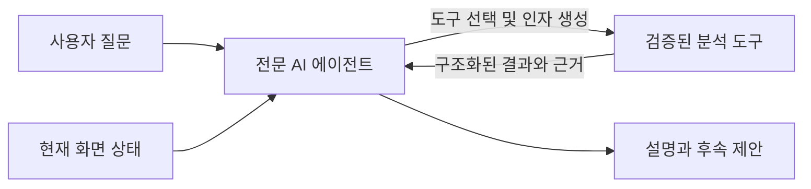
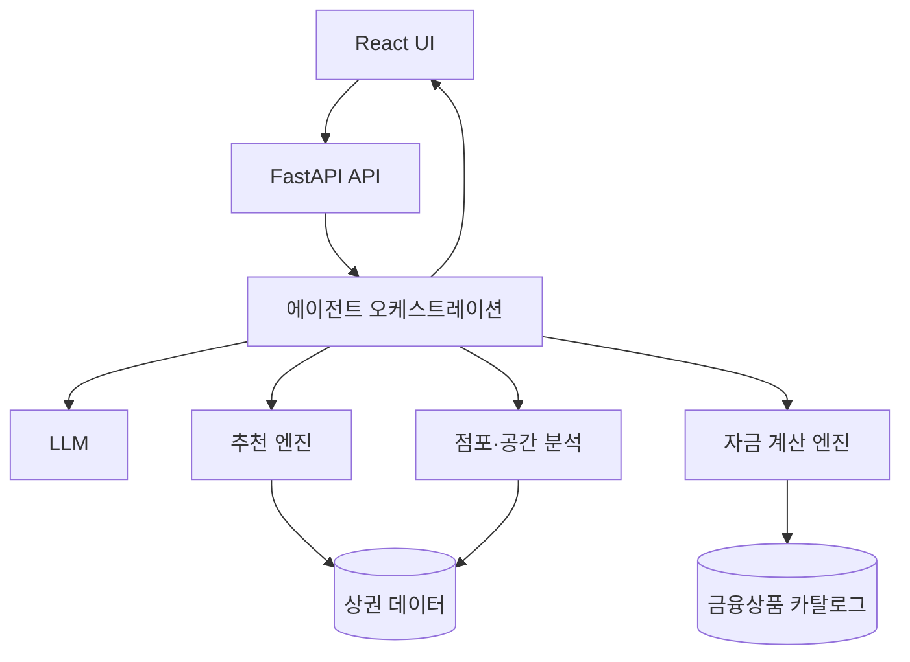

# 대회 출품용 기술설명서 구성 가이드

> 목적: 대회 출품용 파워포인트에서 프로젝트의 문제 해결 가치와 기술적 완성도를 짧고 명확하게 전달한다.  
> 관련 문서: [AI 에이전트·멀티 에이전트 구조](./ai-agent-multi-agent-architecture.md), [카테고리별 AI 봇 역할과 기술 구현](./ai-bot-roles-and-implementation.md), [프로젝트 기술 명세](./project-technical-spec.md)

## 1. 결론

기술설명서의 중심 내용은 다음 세 가지가 맞다.

1. 추천 모델 구현
2. AI 에이전트 구조
3. 프로젝트 전체 구조

다만 이 세 가지만 설명하면 “무엇을 만들었는지”는 보이지만, “왜 필요한지”, “실제로 잘 동작하는지”, “다른 서비스와 무엇이 다른지”가 부족할 수 있다. 심사 자료에는 다음 내용을 함께 포함하는 것이 좋다.

- 해결하려는 문제와 사용자 가치
- 사용 데이터와 전처리 방식
- 정량적 또는 시나리오 기반 검증 결과
- 안전장치와 한계
- 실제 서비스 이용 흐름
- 기존 방식과의 차별점

따라서 권장 구성은 **문제와 사용자 흐름 → 데이터 → 추천 모델 → 검증 → 에이전트 → 안전성 → 전체 구조 → 결과와 차별점** 순서다.

## 2. 발표 전체를 관통하는 핵심 메시지

이 프로젝트는 단순한 챗봇이 아니라 상권 탐색부터 점포 선택, 자금 계획까지 이어지는 창업 의사결정 지원 서비스다.

핵심 기술 메시지는 다음과 같이 정리한다.

> LLM이 추천 점수나 필요 자금을 임의로 계산하지 않는다. 검증 가능한 분석·규칙 엔진이 실제 값을 계산하고, AI 에이전트는 사용자 의도를 해석하여 적절한 도구를 호출한 뒤 근거와 결과를 설명한다.

프로젝트의 에이전트 구조를 설명할 때는 다음 표현이 가장 정확하다.

> **전문 에이전트와 결정론적 분석 도구를 UI 워크플로로 조정하는 멀티 에이전트형 구조**

현재 구현은 에이전트들이 서로 자유롭게 대화하며 업무를 위임하는 완전 자율형 멀티 에이전트 시스템은 아니다. 사용자가 상권 분석, 점포 분석, 자금 계획 단계를 이동하면 해당 단계에 맞는 전문 에이전트와 도구가 선택되는 구조다. 이 표현이 실제 구현과 발표 내용 사이의 과장을 막아준다.

## 3. 권장 슬라이드 구성: 8~10장

### 1장. 문제 정의와 사용자 가치

#### 전달할 내용

- 예비 창업자는 상권 통계, 점포 정보, 비용, 금융상품을 서로 다른 경로에서 찾아야 한다.
- 정보가 흩어져 있어 비교 기준이 일관되지 않고, 분석 결과를 실제 의사결정으로 연결하기 어렵다.
- 본 서비스는 상권 탐색, 점포 선택, 자금 조달 계획을 하나의 흐름으로 연결한다.

#### 한 줄 메시지

> 흩어진 창업 정보를 하나의 의사결정 흐름으로 연결한다.

#### 권장 시각 자료

기존 방식과 제안 방식의 사용자 여정을 간단히 비교한다.

```text
기존: 여러 사이트 탐색 → 수기 비교 → 비용 계산 → 금융상품 재검색
제안: 조건 입력 → 상권 추천 → 점포 분석 → 자금 계획 → AI 근거 설명
```

### 2장. 서비스 사용자 흐름

#### 전달할 내용

1. 사용자가 희망 업종과 창업 조건을 입력한다.
2. 시스템이 후보 상권을 추천하고 근거를 제공한다.
3. 선택한 상권 안에서 점포를 조회하고 비교한다.
4. 보증금, 임대료, 공사비 등으로 필요 자금을 계산한다.
5. 금융 후보와 가상 시나리오를 비교한다.
6. 각 단계의 AI 에이전트가 현재 화면과 선택 상태를 기반으로 설명한다.

#### 한 줄 메시지

> 분석 결과가 다음 단계의 입력이 되는 연속형 창업 지원 경험이다.

### 3장. 데이터와 전처리

#### 전달할 내용

- 상권·점포·임대비용·금융상품 등 어떤 데이터를 사용하는지 제시한다.
- 데이터 출처, 기준 시점, 갱신 방식이 있다면 함께 표시한다.
- 지역 코드, 업종 코드, 좌표 체계 등 서로 다른 데이터의 결합 기준을 설명한다.
- 결측치, 이상치, 표준화 또는 정규화 처리 방식을 간략히 보여준다.

#### 심사 관점에서 중요한 질문

- 추천 점수의 입력값은 신뢰할 수 있는가?
- 서로 다른 데이터는 어떤 키로 결합했는가?
- 데이터가 없을 때 시스템은 어떻게 동작하는가?

#### 한 줄 메시지

> 추천과 자금 계산의 근거가 되는 데이터를 동일한 지역·업종 기준으로 정제했다.

### 4장. 추천 모델 구현

#### 전달할 내용

- 추천의 입력값과 출력값
- 후보 생성과 순위화 방식
- 주요 평가 지표와 가중치
- 점수 정규화 방식
- 추천 근거 생성 방식
- 동일 입력에 동일 결과가 나오는 재현 가능성

추천 모델이 규칙 기반 또는 가중합 기반이라면 이를 숨길 필요가 없다. 대회에서는 복잡한 모델보다 문제에 맞는 설계, 설명 가능성, 검증 가능성이 더 중요할 수 있다.

#### 설명 예시

```text
입력: 희망 업종, 예산, 지역 조건, 선호 지표
후보 생성: 조건을 충족하는 상권 필터링
점수 계산: 매출·유동인구·경쟁도·비용 등 지표 정규화 후 가중합
출력: 추천 순위, 세부 지표, 추천 및 주의 근거
```

#### 반드시 구분할 내용

- **추천 엔진**: 후보 필터링, 지표 계산, 점수화, 순위 결정
- **AI 에이전트**: 사용자 질의 해석, 추천 도구 호출, 결과 요약과 후속 안내

#### 한 줄 메시지

> 추천 순위는 검증 가능한 엔진이 계산하고, AI는 그 근거를 사용자의 조건에 맞게 설명한다.

### 5장. 추천 모델과 핵심 기능 검증

#### 전달할 내용

가능한 범위에서 다음 중 하나 이상을 제시한다.

- 대표 사용자 조건별 추천 결과
- 가중치 또는 입력 변화에 따른 결과 비교
- 상식적 기준이나 전문가 판단과의 비교
- API·서비스 단위 테스트 결과
- 결측치와 예외 입력 처리 결과
- 응답 시간 또는 처리량

학습형 모델이 아니어서 정확도 지표가 없다면, 억지로 정확도라는 표현을 쓰지 않는다. 대신 추천의 일관성, 조건 충족률, 시나리오 적합성, 예외 처리, 재현 가능성을 검증 대상으로 삼는다.

#### 한 줄 메시지

> 대표 시나리오와 자동화 테스트를 통해 추천 결과의 일관성과 시스템 안정성을 확인했다.

### 6장. AI 에이전트와 도구 호출 구조

#### 전달할 내용

- 상권 분석, 점포 분석, 자금 계획 에이전트의 역할
- 각 에이전트가 사용할 수 있는 도구
- 현재 화면의 상태가 에이전트 입력으로 전달되는 방식
- 도구 결과를 근거로 최종 답변을 만드는 과정

#### 역할 구분

| 영역 | AI 에이전트의 역할 | 실제 계산·조회 도구 |
|---|---|---|
| 상권 분석 | 조건 해석, 추천 요청, 지표와 근거 설명 | 상권 조회 및 추천 엔진 |
| 점포 분석 | 현재 상권·업종·점포 맥락 이해, 점포 비교, 외부 조사 요청 | 점포 조회, 공간 분석, 제한된 웹 조사 |
| 자금 계획 | 현재 비용 조건 해석, 계산·비교·가상 시나리오 요청 | 자금 계산 엔진, 금융상품 카탈로그 |

#### 처리 흐름



#### 한 줄 메시지

> AI는 현재 사용자 상태에 맞는 도구를 선택하고, 실제 도구 결과에 근거해 답변한다.

### 7장. 안전성, 신뢰성, 한계

#### 전달할 내용

- 요청 스키마를 검증하여 임의의 지역·점포·금융 후보 접근을 제한한다.
- 허용된 도구만 호출할 수 있도록 도구 목록과 범위를 제한한다.
- 계산 결과와 AI 설명을 분리하고, 도구 출력 근거를 화면에 표시한다.
- 관리비나 권리금 등 필수 입력이 없으면 임의 값을 채우지 않고 계산을 중단한다.
- 가상 시나리오는 저장 데이터를 변경하지 않는 비영속 계산으로 처리한다.
- 금융상품 결과는 승인이나 대출 가능성 보장이 아닌 기본 조건 기반 안내임을 명시한다.
- 데이터의 기준 시점, 모델의 범위, 외부 정보의 불확실성을 함께 표시한다.

#### 한 줄 메시지

> 생성형 AI의 유연성은 활용하되, 계산과 권한은 검증 가능한 서버 로직으로 통제한다.

### 8장. 프로젝트 전체 구조

#### 전달할 내용

- 프론트엔드, 백엔드, 데이터, AI 모델, 분석 엔진의 관계
- 사용자 상태와 도구 결과가 이동하는 방향
- 모듈 분리로 얻는 유지보수성과 확장성



#### 설명 포인트

- UI는 사용자의 현재 상권, 업종, 점포, 자금 입력 상태를 관리한다.
- FastAPI는 입력 검증과 서비스 조합을 담당한다.
- 에이전트 계층은 질문을 해석하고 허용된 도구를 선택한다.
- 분석 엔진은 추천 점수와 금액을 결정론적으로 계산한다.
- 데이터 계층은 정적 데이터와 출처 정보를 제공한다.

#### 한 줄 메시지

> 생성형 AI, 분석 엔진, 데이터 계층을 분리하여 설명 가능성과 기능 확장성을 확보했다.

### 9장. 데모와 결과

#### 전달할 내용

하나의 대표 사용자 시나리오를 처음부터 끝까지 보여준다.

```text
예시 사용자
- 희망 업종: 카페
- 희망 지역: 서울 특정 권역
- 창업 예산: 설정된 금액

데모
1. 추천 상권과 추천 근거 확인
2. 선택 상권의 점포 비교
3. 선택 점포의 필요 자금 계산
4. 금융 후보 비교
5. AI에게 조건 변경 시나리오 질문
6. 도구 호출 근거와 변경 결과 확인
```

화면을 많이 나열하기보다 입력이 어떻게 추천 결과가 되고, 그 결과가 다음 단계에 어떻게 이어지는지 보여주는 것이 중요하다.

#### 한 줄 메시지

> 하나의 사용자 조건이 상권 선택부터 자금 계획까지 끊김 없이 이어진다.

### 10장. 차별점, 한계, 확장 계획

#### 차별점 예시

- 단순 정보 조회가 아니라 상권, 점포, 자금을 하나의 상태로 연결한다.
- AI 답변과 실제 분석 엔진을 분리하여 계산 근거를 검증할 수 있다.
- 현재 화면의 선택 상태를 사용하므로 일반 챗봇보다 맥락에 맞는 답변을 제공한다.
- 구조화된 도구 결과를 함께 제공하여 설명의 출처를 추적할 수 있다.
- 시나리오 계산을 통해 조건 변화의 영향을 즉시 비교할 수 있다.

#### 한계 예시

- 데이터 기준 시점 이후의 시장 변화를 즉시 반영하지 못할 수 있다.
- 추천 점수는 사업 성공 확률을 보장하지 않는다.
- 금융상품 비교는 기본 자격 조건 기반이며 실제 심사를 대체하지 않는다.
- 현재는 UI 워크플로 중심 조정 구조이며, 에이전트 간 자율 위임은 제한적이다.

#### 확장 방향 예시

- 데이터 갱신 자동화와 품질 모니터링
- 사용자 피드백을 활용한 추천 가중치 개선
- 에이전트 간 구조화된 업무 인계
- 승인 절차가 포함된 변경형 도구
- 실제 운영 환경의 관찰성, 비용, 지연시간 최적화

#### 한 줄 메시지

> 현재 구현의 범위를 명확히 밝히면서 데이터와 에이전트 오케스트레이션의 확장 가능성을 제시한다.

## 4. 발표 시간이 짧을 때의 최소 5장 구성

발표 시간이 짧다면 다음 다섯 장으로 압축한다.

### 1장. 문제와 전체 사용자 흐름

- 해결하려는 문제
- 타깃 사용자
- 상권 분석 → 점포 분석 → 자금 계획 흐름

### 2장. 데이터와 추천 모델

- 데이터 출처와 주요 지표
- 후보 생성, 점수화, 순위화
- 추천 근거 제공 방식

### 3장. AI 에이전트 구조

- 세 영역의 전문 역할
- 현재 상태 전달 방식
- 에이전트의 도구 호출과 결과 설명

### 4장. 프로젝트 전체 구조와 안전장치

- React, FastAPI, LLM, 분석 엔진, 데이터 계층
- 입력 검증, 도구 제한, 결정론적 계산, 근거 출력

### 5장. 검증 결과와 차별점

- 대표 데모 시나리오
- 테스트 또는 성능 결과
- 기존 방식과의 차이
- 한계와 확장 방향

## 5. 발표에서 강조할 구현 구분

### 5.1 AI가 담당하는 부분

- 자연어 의도 파악
- 현재 화면 상태와 질문의 결합
- 호출할 도구 선택
- 도구 인자 구성
- 구조화된 결과 요약
- 사용자가 이해하기 쉬운 근거 설명
- 다음 행동 제안

### 5.2 서버의 결정론적 로직이 담당하는 부분

- 상권 및 점포 데이터 조회
- 지역·업종 조건 필터링
- 추천 점수와 순위 계산
- 공간 포함 관계와 통계 집계
- 필요 자금 및 부족 자금 계산
- 금융 후보의 기본 자격 조건 판정
- 가상 조건에 따른 재계산

### 5.3 발표에서 피해야 할 표현

| 피해야 할 표현 | 권장 표현 |
|---|---|
| AI가 최적의 상권을 판단한다 | 추천 엔진이 조건별 점수를 계산하고 AI가 근거를 설명한다 |
| AI가 대출 가능 여부를 결정한다 | 규칙 엔진이 기본 조건을 비교하고 AI가 결과와 주의사항을 설명한다 |
| 완전 자율형 멀티 에이전트다 | 전문 에이전트를 UI 워크플로로 조정하는 멀티 에이전트형 구조다 |
| AI가 모든 데이터를 실시간으로 분석한다 | 현재 제공되는 데이터와 허용된 조회 도구 범위에서 분석한다 |
| 추천 결과가 창업 성공을 보장한다 | 추천 결과는 의사결정을 지원하는 참고 지표다 |

## 6. 심사위원이 확인할 가능성이 높은 질문

### 추천 모델

- 왜 이 지표들을 선택했는가?
- 가중치는 어떤 근거로 정했는가?
- 입력 조건이 바뀌면 결과가 합리적으로 달라지는가?
- 결과를 재현할 수 있는가?

### AI 에이전트

- 일반 챗봇과 무엇이 다른가?
- 어떤 도구를 언제 호출하는가?
- AI가 잘못된 값이나 존재하지 않는 정보를 만들면 어떻게 하는가?
- 도구 실패 시 사용자에게 어떻게 안내하는가?

### 데이터와 서비스

- 데이터 출처와 기준 시점은 무엇인가?
- 결측치나 데이터가 없는 지역은 어떻게 처리하는가?
- 사용자 상태와 개인정보는 어떻게 다루는가?
- 실제 서비스로 확장할 때 가장 먼저 개선할 부분은 무엇인가?

이 질문에 대한 답을 각 슬라이드의 발표자 노트에 한두 문장씩 준비하면 질의응답 대응력이 높아진다.

## 7. 슬라이드 작성 원칙

- 한 장에는 핵심 주장 하나만 둔다.
- 구조도에는 모든 클래스명을 넣기보다 책임과 데이터 흐름을 보여준다.
- 코드 화면보다 입력, 처리, 출력의 관계를 우선한다.
- 기술 용어는 사용자 가치와 연결해서 설명한다.
- 추천 결과와 AI 답변 화면에는 가능한 한 근거 데이터를 함께 표시한다.
- 구현 완료 기능과 향후 계획을 시각적으로 구분한다.
- 수치가 있다면 측정 조건과 기준을 함께 표시한다.
- 실제 구현보다 큰 범위의 표현을 사용하지 않는다.

## 8. 최종 점검표

### 문제와 가치

- [ ] 누구의 어떤 문제를 해결하는지 한 문장으로 설명할 수 있다.
- [ ] 기존 방식 대비 사용자 동선이 어떻게 줄어드는지 보인다.

### 데이터와 추천

- [ ] 데이터 출처와 기준 시점이 표시되어 있다.
- [ ] 추천 입력, 계산, 출력 구조가 보인다.
- [ ] 추천 지표와 가중치의 이유를 설명할 수 있다.
- [ ] 결과 검증 사례가 하나 이상 있다.

### 에이전트

- [ ] 일반 챗봇과 도구 호출 에이전트의 차이를 설명한다.
- [ ] LLM과 결정론적 엔진의 책임이 분리되어 있다.
- [ ] 현재 상태, 도구 호출, 근거 출력 흐름이 보인다.
- [ ] 현재 구조를 완전 자율형으로 과장하지 않는다.

### 프로젝트 구조와 안정성

- [ ] 프론트엔드, 백엔드, AI, 분석 엔진, 데이터의 관계가 보인다.
- [ ] 입력 검증과 도구 호출 제한을 설명한다.
- [ ] 결측값과 실패 상황의 처리 정책이 있다.

### 결과와 전달력

- [ ] 처음부터 끝까지 이어지는 데모 시나리오가 있다.
- [ ] 차별점이 기능 나열이 아니라 구조적 장점으로 설명되어 있다.
- [ ] 현재 한계와 확장 방향을 구분해서 제시한다.

## 9. 발표용 요약 문장

발표 도입부에는 다음 문장을 사용할 수 있다.

> 본 프로젝트는 예비 창업자가 상권 탐색, 점포 비교, 자금 계획을 하나의 흐름에서 수행할 수 있도록 만든 AI 기반 의사결정 지원 서비스입니다.

기술 구조 설명에는 다음 문장을 사용할 수 있다.

> 추천 점수와 자금은 검증 가능한 분석 엔진이 계산하며, AI 에이전트는 사용자의 질문과 현재 선택 상태를 해석해 적절한 도구를 호출하고 그 결과를 근거와 함께 설명합니다.

에이전트 구조 설명에는 다음 문장을 사용할 수 있다.

> 현재 구조는 상권, 점포, 자금 계획 영역의 전문 에이전트를 UI 워크플로로 조정하는 멀티 에이전트형 구조이며, 각 에이전트의 권한과 데이터 범위를 서버에서 제한합니다.

마무리에는 다음 문장을 사용할 수 있다.

> 생성형 AI의 대화 능력과 결정론적 분석 엔진의 신뢰성을 결합해, 단순 정보 제공을 넘어 근거를 확인하고 조건을 비교할 수 있는 창업 의사결정 경험을 구현했습니다.
