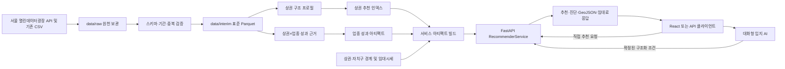
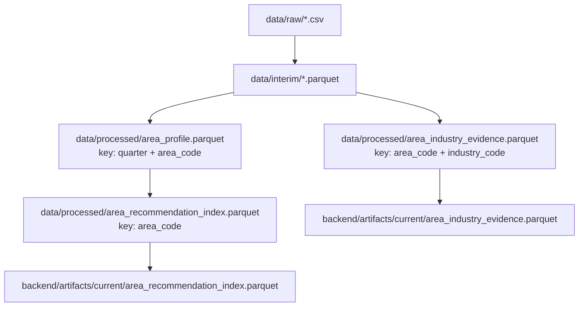
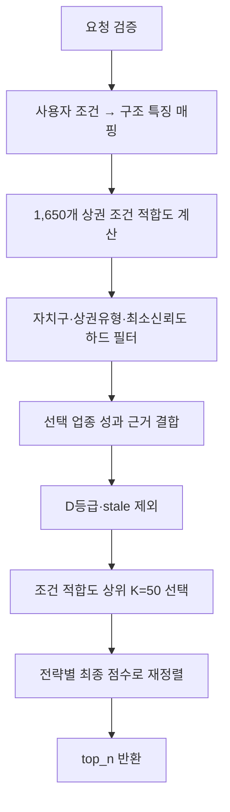
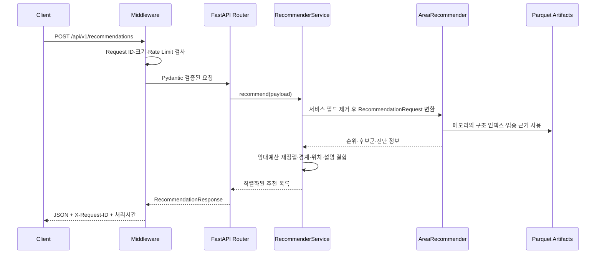
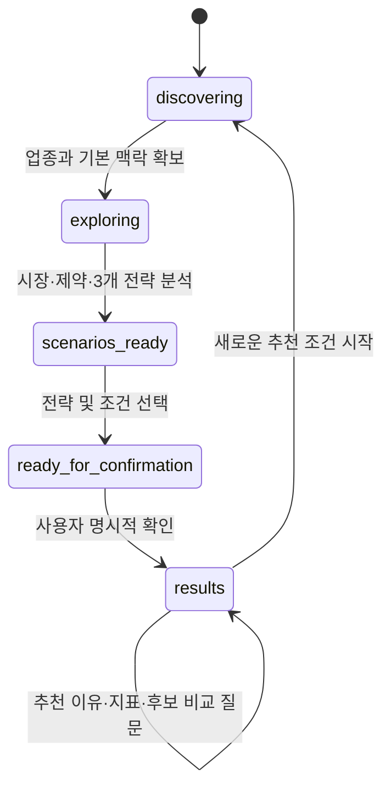
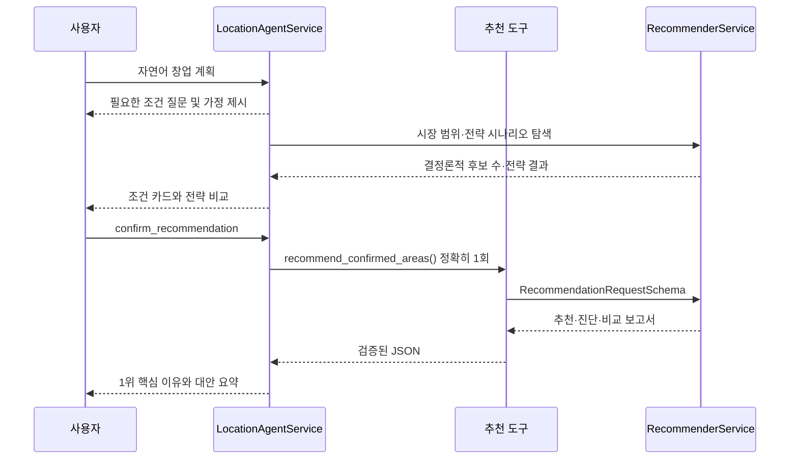

# KB AI Challenge — 대화형 AI 상권 입지 추천 기술명세서

> 문서 기준 버전: 서비스 아티팩트 `2025q4-v3` / 스키마 버전 `4`  
> 데이터 기준: 업종 성과 `2021Q1~2025Q4`, 상권 구조 `2024Q1~2025Q4`, 임대시세 `2026Q1`

관련 시각화: [유스케이스 및 시스템 아키텍처](./system-diagrams.md)

## 1. 프로젝트 소개

이 프로젝트는 예비 창업자가 업종, 희망 지역, 주요 고객층, 운영 시간, 주변 인구와 시설의 중요도 등을 입력하면 서울시 상권 중 조건에 맞는 후보를 추천하는 서비스다. 추천 결과는 단순 순위뿐 아니라 다음 정보를 함께 제공한다.

- 사용자 조건과 상권 구조가 얼마나 잘 맞는지 나타내는 **조건 적합도**
- 선택 업종이 해당 상권에서 실제로 보여 준 매출·성장·안정성 근거
- 자료의 기간·연속성·표본 규모를 반영한 **데이터 신뢰도**
- 상권별 추천 이유, 위험 요인, 실제 상권 경계, 임대료 추정치
- 동일 조건을 만족하는 전체 후보 중앙값과 상위 후보의 비교 보고서

시스템의 핵심 원칙은 **AI와 추천 모델의 책임 분리**다. 대화형 AI는 자연어에서 창업 조건을 정리하고 추가 질문과 결과 설명을 담당한다. 추천 순위, 점수, 매출 지표는 AI가 생성하거나 재계산하지 않고 동일 입력에 항상 동일 결과를 반환하는 결정론적 추천 엔진이 계산한다.

### 1.1 전체 아키텍처



### 1.2 기술 구성

| 영역 | 주요 기술 | 역할 |
|---|---|---|
| 데이터 처리 | Python, pandas, NumPy, PyArrow | CSV 수집·정제, 특징 생성, Parquet 저장 |
| 공간 데이터 | GeoPandas, Shapely | 좌표계 변환, 도형 보정, GeoJSON 경계 생성 |
| 추천 모델 | scikit-learn `RobustScaler`, SciPy | 강건한 스케일링, 가중 거리, 순위 안정성 검증 |
| 백엔드 | FastAPI, Pydantic | 요청 검증, 추천 실행, 응답 계약, 오류 처리 |
| AI 상담 | OpenAI Agents SDK | 자연어 조건 수집, 전략 비교, 도구 호출, 결과 설명 |
| 서비스 데이터 | Parquet + JSON manifest | DB 없이 추천 데이터를 메모리에 적재 |

---

## 2. 데이터 수집

### 2.1 데이터 소스

추천 모델의 기본 데이터는 서울 열린데이터광장 상권분석서비스에서 가져온다. 원천 설정은 `config/datasets.yaml`이 단일 기준점이며, 데이터별 필수 여부, 저장 경로, API 서비스명, 기준 grain, 분석 기간을 선언한다.

| 데이터셋 | ID / API 서비스명 | Grain | 필수 | 주요 용도 |
|---|---|---|---|---|
| 영역-상권 | `OA-15560` / `TbgisTrdarRelm` | 상권 | 필수 | 상권명, 유형, 자치구·행정동, 면적, 좌표 |
| 추정매출-상권 | `OA-15572` / `VwsmTrdarSelngQq` | 분기×상권×업종 | 필수 | 매출 규모, 점포당 매출, 성장률, 변동성 |
| 점포-상권 | `OA-15577` / `VwsmTrdarStorQq` | 분기×상권×업종 | 필수 | 점포 수, 개·폐업률, 프랜차이즈 비율, 경쟁도 |
| 길단위인구-상권 | `OA-15568` / `VwsmTrdarFlpopQq` | 분기×상권 | 필수 | 성별·연령·시간대·요일별 유동인구 |
| 상주인구-상권 | `OA-15584` / `VwsmTrdarRepopQq` | 분기×상권 | 필수 | 상주인구, 가구 규모 |
| 직장인구-상권 | `OA-15569` / `VwsmTrdarWrcPopltnQq` | 분기×상권 | 필수 | 직장인구와 주거·업무 균형 |
| 집객시설-상권 | `OA-15580` / `VwsmTrdarFcltyQq` | 분기×상권 | 필수 | 교통·교육·의료·쇼핑·문화시설 |
| 아파트-상권 | `OA-15566` / `InfoTrdarAptQq` | 분기×상권 | 필수 | 단지·세대 수, 면적, 대표 시세 |
| 상권변화지표-상권 | `OA-15576` / `VwsmTrdarIxQq` | 분기×상권 | 선택 | 영업기간과 상권 변화 유형 |

추가 서비스 데이터는 별도 아티팩트로 관리한다.

- 상권 경계: 서울시 영역-상권 SHP, 원본 좌표계 `EPSG:5181`
- 자치구 경계: JUSO 기반 서울 25개 자치구 경계
- 임대시세: 서울신용보증재단 보증 고객 통계 기반 서울시 상권분석서비스 임대시세

### 2.2 분석 기간

| 구분 | 기간 | 사용 목적 |
|---|---|---|
| 장기 업종 성과 | 2021Q1~2025Q4, 최대 20개 분기 | 성장 추세, 변동성, 매출·점포 이력 |
| 최근 상권 구조 | 2024Q1~2025Q4, 8개 분기 | 현재 인구·시설·주거·점포 구조 |
| 추천 인덱스 대표값 | 2025Q1~2025Q4, 4개 분기 | 서비스 시점의 상권 구조 평균 |
| 임대시세 | 2026Q1 | 임대료 추정과 예산 적합도 |
| 향후 외부 검증 | 2026Q1 | 필수 데이터 확보 전까지 비활성 |

### 2.3 수집 절차

수집 스크립트는 `scripts/download_seoul_data.py`이며 API 설정은 다음과 같다.

- 페이지 크기: 1,000행
- 요청 제한 시간: 30초
- 최대 재시도: 3회
- 재시도 대기: 1초
- 저장 위치: `data/raw/<dataset>/`
- 분기 파일명: `<prefix>_YYYYQ.csv`
- 비분기 상권 마스터: `data/raw/area/area.csv`

API가 분기 경로 필터를 제공하면 요청 경로에 분기를 포함하고, 제공하지 않으면 전체 페이지를 수집한 뒤 `STDR_YYQU_CD`를 기준으로 로컬 분할한다. 추정매출은 기존 2021~2025 연도별 CSV를 기본 재사용하므로 설정상 자동 다운로드가 비활성화되어 있다. 다시 수집하려면 데이터셋과 덮어쓰기 의도를 명시해야 하며 기존 연도 파일을 수정하지 않고 별도 분기 파일을 만든다.

각 CSV 옆에는 인증정보를 제외한 `.meta.json`을 저장한다. 디버그 모드는 상태 코드, Content-Type, 응답 크기, JSON 구조와 행 수를 출력하지만 원천 파일은 저장하지 않는다. URL·본문·예외에 포함된 API 키는 `***MASKED***`로 치환한다.

```bash
# 원천 데이터 점검
.venv/bin/python scripts/check_raw_data.py

# 특정 데이터·분기 수집 진단
.venv/bin/python scripts/download_seoul_data.py \
  --dataset stores --quarters 20211 --debug-api

# 기존 매출 파일은 유지하고 나머지 필수 데이터 수집
.venv/bin/python scripts/download_seoul_data.py --all --skip-sales
```

### 2.4 원천 데이터 검증

전처리 전에 다음 조건을 확인한다.

1. 필수 데이터셋과 필수 키 존재 여부
2. 기대 기간의 분기 커버리지
3. grain 키 기준 중복 여부
4. 상권 마스터와 각 데이터셋의 상권코드 교집합
5. 연도별 행 수 및 주요 수치형 변수 분포 변화
6. 과거 연도와 최근 연도의 상권코드 유지율

검증 결과는 `outputs/tables/`에 인벤토리, 스키마, 중복, 분기 커버리지, 코드 교집합, 연도별 분포 보고서로 저장한다. 필수 데이터가 없으면 보고서를 남긴 뒤 종료 코드 `1`을 반환한다. 완전 중복 행만 제거하며 grain 키가 같은 서로 다른 행은 임의로 합치거나 삭제하지 않고 진단 대상으로 남긴다.

---

## 3. 전처리 및 특징 생성

### 3.1 표준 스키마 변환

`src/data/ingest.py`는 원천 CSV를 읽어 다음 공통 키로 변환한다.

| 표준 컬럼 | 대표 원천 컬럼 | 타입 | 의미 |
|---|---|---|---|
| `quarter` | `기준_년분기_코드`, `STDR_YYQU_CD` | 문자열 | `YYYYQ` 형식 분기 |
| `area_code` | `상권_코드`, `TRDAR_CD` | 문자열 | 상권의 고유 식별자 |
| `area_name` | `상권_코드_명`, `TRDAR_CD_NM` | 문자열 | 상권명 |
| `industry_code` | `서비스_업종_코드`, `SVC_INDUTY_CD` | 문자열 | 서비스 업종 식별자 |
| `industry_name` | `서비스_업종_코드_명`, `SVC_INDUTY_CD_NM` | 문자열 | 업종명 |

표준화 후 분석 기간으로 필터링하고 grain별 키를 검증한다.

- `area`: `area_code`
- `quarter_area`: `quarter + area_code`
- `quarter_area_industry`: `quarter + area_code + industry_code`

출력은 `data/interim/<dataset>.parquet`에 저장한다. Parquet을 사용함으로써 문자열·수치 타입을 보존하고 반복적인 모델 빌드에서 CSV 파싱 비용을 줄인다.

### 3.2 상권 구조 프로필

`src/features/area_profile.py`는 상권 마스터와 분석 분기를 교차 결합해 모든 `분기×상권` 조합을 기준판으로 만든다. 여기에 인구, 점포, 시설, 아파트, 상권변화 블록을 `one-to-one`으로 병합한다.

#### 주요 파생 특징

| 특징 그룹 | 예시 | 처리 방식 |
|---|---|---|
| 유동인구 | 성별·연령·시간대 비율, 주말 비율 | 해당 그룹 수 / 전체 유동인구 |
| 인구 밀도 | 유동·상주·직장인구 밀도 | `log1p(인구 × 1,000,000 / 상권면적㎡)` |
| 주거 | 평균 가구원, 아파트 세대·단지 밀도, 평형 비율 | 안전한 비율 및 로그 밀도 |
| 집객시설 | 교통·교육·의료·쇼핑·문화시설 밀도 | 시설 묶음 합계와 로그 밀도 |
| 점포 구조 | 총점포, 프랜차이즈 비율, 업종 다양성, 개·폐업률 | 상권 단위 집계 및 평활화 |
| 상권 상태 | 상권변화 유형, 평균 영업·폐업 기간 | 원천 범주 및 one-hot |
| 복합 특징 | 직장·상주인구 균형, 순점포 증가율 | 파생 비율·차이 |

분모가 0이거나 결측인 비율 계산은 무한대를 만들지 않고 기본값 `0`을 사용한다. 밀도와 가격처럼 오른쪽 꼬리가 긴 값은 `log1p`로 변환한다. 주요 연속 특징은 전체 분포의 0.5%와 99.5% 경계로 winsorization하여 극단치가 거리 계산을 지배하지 않게 한다.

점포 비율은 점포 수가 적은 상권에서 값이 과도하게 흔들리는 문제를 줄이기 위해 20개 점포 규모의 서울시 전체 사전분포로 평활화한다. 예를 들어 관측 점포 수가 적을수록 개업률·폐업률·프랜차이즈 비율이 도시 전체 평균에 더 가까워진다.

#### 결측과 관측 품질

서울시 API는 값이 0이거나 미보고인 상권을 아예 반환하지 않을 수 있다. 따라서 병합 후 수치형 결측을 0으로 채우되, 실제 관측 여부를 `<dataset>_observed`로 반드시 남긴다. 문자열 결측은 `unknown`으로 처리한다.

상권 구조 신뢰도는 다음처럼 계산한다.

```text
core_fraction         = 유동·상주·직장인구·점포 블록 관측 비율
supplemental_fraction = 시설·아파트·상권변화 블록 관측 비율
history_fraction      = 핵심 블록이 모두 관측된 분기 수 / 전체 프로필 분기 수

area_data_reliability
  = 0.50 × core_fraction
  + 0.20 × supplemental_fraction
  + 0.30 × history_fraction
```

결과는 `data/processed/area_profile.parquet`에 저장하며 특징별 출처, 변환식, 결측 정책, winsorization 경계는 `outputs/tables/area_profile_feature_dictionary.csv`에 기록한다.

### 3.3 상권×업종 성과 근거

`src/features/area_industry_evidence.py`는 매출과 점포 이력을 `area_code + industry_code` 단위로 집계한다. 이 데이터는 사용자 조건과의 유사도를 계산하는 구조 프로필과 분리되어 있어 매출이 조건 적합도에 직접 유입되는 것을 막는다.

#### 성과 지표

| 그룹 | 지표 | 방향 |
|---|---|---|
| 규모·생산성 | 최근 4분기 평균 매출, 최근 4분기 점포당 평균 매출 | 높을수록 유리 |
| 성장성 | 전년 동기 성장률, 최근 4분기 성장률, 장기 매출 추세, 순점포 증가율 | 높을수록 유리 |
| 안정성 | 매출 변동계수, 매출 감소 분기 비율 | 낮을수록 유리 |
| 경쟁 | 동종업종 경쟁 강도 | 낮을수록 유리 |
| 폐업위험 | 폐업률, churn rate, 최근 폐업률 증가 | 낮을수록 유리 |

동종업종 경쟁 강도는 같은 업종 안에서 계산한 점포 밀도 순위 70%와 점포 수 순위 30%를 결합한 내부 지표다. 사용자에게 경쟁을 설명할 때는 이 내부 점수를 직접 노출하지 않고 최신 동종업종 점포 수와 1㎢당 점포 밀도를 제공한다.

매출과 성장률이 없는 경우 0으로 대체하지 않는다. `NaN`을 유지하고 `current_sales_missing_flag`, `recent_4q_partial_observation_flag`, `recent_growth_missing_flag` 등 명시적인 품질 플래그를 함께 저장한다. 일부 성과 지표만 관측된 후보는 가용한 지표의 가중치를 다시 정규화한다.

#### 업종 근거 신뢰도

```text
data_reliability
  = 0.25 × sales_coverage
  + 0.15 × data_continuity
  + 0.25 × recency_score
  + 0.15 × sample_size_score
  + 0.15 × area_profile_data_reliability
  + 0.05 × store_coverage

recency_score    = 0.7 ^ quarter_age
sample_size_score = min(sample_size / 10, 1)
```

| 등급 | 신뢰도 범위 | 추천 처리 |
|---|---|---|
| A | `0.85 ≤ r` | 정상 사용 |
| B | `0.70 ≤ r < 0.85` | 정상 사용, 정보 확인 경고 |
| C | `0.50 ≤ r < 0.70` | 신뢰도 보정 후 10% 감점 |
| D | `r < 0.50` | 후보에서 제외 |

마지막 매출 관측이 기준 분기보다 4개 분기 이상 오래되면 `stale_observation_flag=1`로 표시하고 후보에서 제외한다. 완성 데이터는 `data/processed/area_industry_evidence.parquet`에 저장한다.

### 3.4 처리 결과의 데이터 계약



---

## 4. 추천 모델

### 4.1 추천 요청을 특징으로 변환

요청의 지역·상권유형은 하드 필터로, 고객·운영·주변환경 선호는 거리 특징으로 처리한다.

| 사용자 입력 | 모델 특징 | 처리 |
|---|---|---|
| 희망/제외 자치구 | `district_name` | 후보 포함·제외 필터 |
| 상권 유형 | `area_type_code`, `area_type_name` | 후보 포함 필터 |
| 최소 데이터 신뢰도 | `data_reliability` | 하한 필터 |
| 성별·연령대 | 해당 유동인구 비율 | 높은 방향 목표 |
| 선호 시간대·주말 중요도 | 시간대·주말 유동 비율 | 높은 방향 목표 |
| 유동·상주·직장인구 중요도 | 각 로그 밀도 | 높은 방향 목표 |
| 아파트·시설 중요도 | 각 로그 밀도 | 높은 방향 목표 |
| 점포 밀도·프랜차이즈 선호 | 밀도·비율 | `high` 또는 `low` 방향 목표 |

선택하지 않은 선택형 조건과 중요도 `0`인 조건은 거리 계산에서 제외한다. 업종만 입력한 요청은 모든 상권 구조를 제한하지 않으므로 조건 적합도가 모두 100점이며, 업종 성과와 신뢰도에 따라 순위가 정해진다.

### 4.2 상권 추천 인덱스

`build_recommendation_index`는 상권 프로필의 최근 4개 분기(`2025Q1~2025Q4`) 평균을 상권별 한 행으로 축약한다. 유동·상주·직장인구, 아파트 세대, 점포 밀도에는 전체 이력의 선형 추세도 추가한다. 이 단계에서 특징 이름에 `sales` 또는 `매출`이 포함되면 빌드를 중단해 조건 적합도와 업종 성과의 정보 누출을 방지한다.

현재 배포 인덱스는 서울 상권 1,650개 행으로 구성된다.

### 4.3 조건 적합도

선택된 특징 벡터를 상권 전체의 중앙값과 IQR에 강건한 `RobustScaler`로 표준화한 뒤 각 특징을 1%~99% 경계로 제한한다. 사용자가 높은 값을 원하면 99% 지점을, 낮은 값을 원하면 1% 지점을 목표값으로 둔다.

상권 `i`의 가중 유클리드 거리는 다음과 같다.

```text
d_i = sqrt( Σ_j w_j × (x_ij - t_j)² / Σ_j w_j )
```

- `x_ij`: 스케일링된 상권 `i`의 특징 `j`
- `t_j`: 사용자가 원하는 방향의 목표값
- `w_j`: 사용자가 입력한 중요도

거리의 최솟값과 최댓값을 이용해 0~100점으로 변환한다.

```text
condition_fit_i = 100 × (d_max - d_i) / (d_max - d_min)
```

모든 거리가 같으면 100점으로 처리한다. 기본 거리는 유클리드이며 코사인 유사도는 민감도 비교용으로만 지원한다.

### 4.4 업종 성과 점수

선택 업종의 상권끼리 각 성과 지표를 순위 백분위 0~100점으로 변환한다. 긍정 지표는 값이 클수록, 위험 지표는 값이 작을수록 높은 점수를 받는다. 지표별 가중합은 결측 지표를 제외한 가용 가중치로 나누어 계산한다.

```text
raw_evidence_score_i
  = Σ(관측된 지표 점수 × 지표 가중치) / Σ(관측된 지표 가중치)
```

기본 `balanced` 전략의 성과 그룹 비중은 다음과 같다.

| 성과 그룹 | 기본 비중 |
|---|---:|
| 규모·생산성 | 35% |
| 성장성 | 27% |
| 안정성 | 18% |
| 경쟁 | 8% |
| 폐업위험 | 12% |

`performance_group_weights`를 보내면 다섯 그룹 값을 모두 입력해야 하며, 서버가 합계를 1로 정규화한다. 음수, 무한대, `NaN`, 합계 0, 누락·추가 그룹은 거부한다. 그룹 안에서는 기존 지표 간 상대 비중을 유지한다.

### 4.5 신뢰도 보정

낮은 신뢰도의 점수를 단순 곱셈으로 크게 낮추는 대신 해당 업종의 평균 점수 쪽으로 축소한다.

```text
shrinkage_score_i
  = r_i × raw_evidence_score_i
  + (1 - r_i) × industry_mean_score

reliability_adjusted_evidence_score_i
  = shrinkage_score_i × 0.9   # C등급만
```

A·B등급에는 추가 감점이 없고 D등급과 stale 후보는 최종 후보 결합 전에 제외한다.

### 4.6 전략별 최종 점수

| 전략 | 조건 적합도 | 신뢰도 보정 성과 | 성과 그룹 특징 |
|---|---:|---:|---|
| `balanced` | 60% | 40% | 기본 균형 |
| `condition_fit` | 75% | 25% | 사용자 조건 우선 |
| `growth` | 45% | 55% | 성장 그룹 50% 중심 |
| `stability` | 45% | 55% | 안정성 35%, 폐업위험 25% 중심 |

```text
final_score_i
  = strategy_condition_weight × condition_fit_score_i
  + strategy_evidence_weight × reliability_adjusted_evidence_score_i
```

최종 점수는 0~100으로 제한한다.

### 4.7 후보 선택과 정렬



이 구현에서 `K=50`은 학습 데이터의 최근접 이웃으로 값을 예측하는 일반적인 KNN 회귀의 `k`와 다르다. 구조적으로 가까운 상권 후보군의 크기를 의미한다. 후보군 안에서 업종 성과를 결합해 최종 순위를 다시 계산한다. 따라서 현재 서비스 모델은 **가중 거리 기반 후보 탐색 + 관측 성과 기반 재순위화**로 표현하는 것이 정확하다.

동점은 `final_score` 내림차순, `condition_fit_score` 내림차순, `area_code` 오름차순으로 정렬해 결과를 결정론적으로 유지한다.

### 4.8 임대예산 재정렬

임대면적과 층 구분을 입력하면 행정동 임대시세에 면적을 적용한 월 환산임대료를 추정한다. 행정동 자료가 없으면 같은 분기의 자치구 값으로, 선택 층 값이 없으면 전체 층 평균으로 대체하며 응답에 fallback 여부를 표시한다.

월 환산임대료 한도까지 입력하고 유효한 임대료 추정치가 하나 이상 있을 때만 후보 50개를 다음처럼 재정렬한다.

```text
budget_final_score
  = 0.80 × base_final_score
  + 0.20 × budget_fit_score
```

총 창업예산만 입력하거나 월 임대료 한도가 없으면 기존 추천 순위와 점수를 바꾸지 않는다. 비용 아티팩트가 없으면 추천은 계속 제공하고 `budget_adjusted=false`와 원인을 진단 정보에 남긴다.

---

## 5. 서비스 아티팩트

노트북과 처리 모듈이 만든 분석 산출물을 API가 직접 읽는 서비스 아티팩트로 변환한다.

```bash
.venv/bin/python backend/pipelines/scripts/build_service_artifacts.py
```

### 5.1 배포 파일

| 파일 | 행 수 | 역할 |
|---|---:|---|
| `area_recommendation_index.parquet` | 1,650 | 상권별 구조 특징과 위치 메타데이터 |
| `area_industry_evidence.parquet` | 26,810 | 상권×업종별 관측 성과와 품질 |
| `area_boundaries.parquet` | 1,650 | 상권별 Polygon/MultiPolygon GeoJSON |
| `district_boundaries.parquet` | 25 | 서울 자치구 경계 |
| `commercial_rent_observations.parquet` | 14,791 | 행정동·자치구·층별 환산임대료 |
| `manifest.json` | 1 | 버전, 기간, 행 수, SHA-256, 좌표계 |

상권 경계는 `EPSG:5181`에서 WGS84 `EPSG:4326`으로 변환하고 `shapely.make_valid`로 유효하지 않은 도형을 보정한다.

### 5.2 서버 시작 검증

FastAPI lifespan에서 `RecommenderService`가 아티팩트를 한 번 로드한다. 로더는 다음 검사를 통과해야 준비 상태가 된다.

1. `manifest.json`과 모든 필수 파일 존재
2. 파일 SHA-256이 manifest 값과 일치
3. 추천 인덱스와 성과 근거의 필수 컬럼 존재
4. 상권 경계의 `area_code` 고유성
5. 추천 인덱스와 상권 경계의 코드 집합 일치
6. 자치구 코드·이름 고유성과 정확히 25개 경계 존재
7. 경계 JSON이 Polygon 또는 MultiPolygon 형식

추천 엔진은 운영 중 데이터베이스를 조회하지 않고 메모리에 적재된 Parquet 데이터로 동작한다. 아티팩트 로딩이 실패하면 `/health/live`는 프로세스 생존을 표시할 수 있지만 `/health/ready`와 추천 요청은 일반화된 503 오류를 반환한다. 파일 경로·DB 오류 같은 내부 원인은 응답에 포함하지 않고 request ID와 함께 서버 로그에만 남긴다.

---

## 6. FastAPI 백엔드 연결

### 6.1 요청 처리 흐름



### 6.2 주요 엔드포인트

| Method | 경로 | 역할 |
|---|---|---|
| `GET` | `/api/v1/health/live` | API 프로세스 생존 확인 |
| `GET` | `/api/v1/health/ready` | 추천 아티팩트 준비 상태와 버전 확인 |
| `GET` | `/api/v1/metadata` | 업종, 자치구, 상권유형, 연령·시간대, 임대층, 성과 가중치 프리셋 |
| `POST` | `/api/v1/recommendations` | 구조화 조건으로 결정론적 추천 실행 |
| `POST` | `/api/v1/agent/turns` | 대화형 입지 상담과 확인된 추천 실행 |

개발 환경의 OpenAPI 문서는 `http://localhost:8000/docs`에서 확인할 수 있으며 운영 환경에서는 비활성화된다.

### 6.3 추천 요청 계약

`RecommendationRequestSchema`는 선언되지 않은 추가 필드를 거부하고 `NaN`·무한대를 허용하지 않는다.

| 필드 | 타입/범위 | 기본값 | 설명 |
|---|---|---:|---|
| `industry_code` | 비어 있지 않은 문자열 | 필수 | 추천 대상 업종 |
| `preferred_area_types` | 문자열 배열 | `[]` | 희망 상권유형 |
| `target_gender` | `male`, `female`, `null` | `null` | 주요 고객 성별 |
| `target_age_groups` | `10`~`60_plus` 배열 | `[]` | 주요 고객 연령대 |
| `preferred_time_bands` | 6개 시간대 코드 배열 | `[]` | 주요 영업 시간대 |
| 각종 `*_importance` | `0~1` | `0` | 인구·시설·주말 중요도 |
| `store_density_preference` | `high`, `low`, `null` | `null` | 점포 밀도 선호 |
| `franchise_preference` | `high`, `low`, `null` | `null` | 프랜차이즈 비율 선호 |
| `preferred_districts` | 문자열 배열 | `[]` | 포함 자치구 |
| `excluded_districts` | 문자열 배열 | `[]` | 제외 자치구 |
| `min_data_reliability` | `0~1` | `0` | 최소 데이터 신뢰도 |
| `top_n` | `1~50` | `10` | 반환 후보 수 |
| `strategy` | 4개 전략 | `balanced` | 최종 점수 정책 |
| `performance_group_weights` | 5개 그룹 객체 또는 `null` | `null` | 사용자 정의 성과 가중치 |
| `total_startup_budget_krw` | 양수 또는 `null` | `null` | 총 창업예산, 현재 순위에는 미반영 |
| `monthly_converted_rent_limit_krw` | 양수 또는 `null` | `null` | 월 환산임대료 한도 |
| `rentable_area_sqm` | `0 < x ≤ 10,000` | `null` | 전용+공용 임대면적 |
| `floor` | `all`, `f1`, `non_f1` | `null` | 전체 층 평균·1층·1층 외 구분 |

임대면적과 층은 둘 다 입력하거나 둘 다 생략해야 한다. 월 임대료 한도를 사용하려면 두 필드가 모두 필요하다.

#### 최소 요청

```json
{
  "industry_code": "CS100001"
}
```

#### 조건·전략·사용자 가중치를 포함한 요청

```json
{
  "industry_code": "CS100001",
  "preferred_districts": ["강남구", "마포구"],
  "target_age_groups": ["20", "30"],
  "preferred_time_bands": ["17_21", "21_24"],
  "weekend_importance": 0.8,
  "floating_population_importance": 0.7,
  "store_density_preference": "low",
  "strategy": "growth",
  "performance_group_weights": {
    "scale_productivity": 20,
    "growth": 40,
    "stability": 20,
    "competition": 5,
    "closure_risk": 15
  },
  "monthly_converted_rent_limit_krw": 5000000,
  "rentable_area_sqm": 66.0,
  "floor": "f1",
  "top_n": 3
}
```

### 6.4 추천 응답 계약

```json
{
  "request_id": "d7785af0-...",
  "artifact_version": "2025q4-v3",
  "recommendations": [
    {
      "rank": 1,
      "area_code": "3001491",
      "area_name": "상권명",
      "district_name": "강남구",
      "industry_code": "CS100001",
      "industry_name": "한식음식점",
      "latitude": 37.0,
      "longitude": 127.0,
      "boundary": {"type": "Polygon", "coordinates": []},
      "final_score": 82.41,
      "base_final_score": 80.15,
      "budget_fit_score": 91.45,
      "budget_adjusted": true,
      "condition_fit_score": 78.3,
      "raw_evidence_score": 84.1,
      "reliability_adjusted_evidence_score": 82.8,
      "data_reliability": 0.91,
      "reliability_grade": "A",
      "positive_reasons": [],
      "negative_reasons": [],
      "performance_breakdown": {},
      "warnings": [],
      "rental_estimate": {}
    }
  ],
  "diagnostics": {
    "policy_version": "strategy-v1",
    "selected_k": 50,
    "performance_weights_source": "user_custom"
  }
}
```

위 값과 빈 배열·객체는 계약 설명을 위한 축약 예시이며 실제 응답은 해당 아티팩트와 입력 조건으로 계산한다.

#### 주요 결과 필드

| 필드 | 의미 |
|---|---|
| `final_score` | 현재 전략과 예산 조건까지 반영한 최종 점수 |
| `base_final_score` | 예산 재정렬 전 점수, 재정렬하지 않으면 `null` |
| `condition_fit_score` | 사용자 조건과 상권 구조의 적합도 |
| `raw_evidence_score` | 신뢰도 보정 전 업종 성과 백분위 점수 |
| `reliability_adjusted_evidence_score` | 업종 평균 축소와 등급 정책을 반영한 성과 점수 |
| `performance_breakdown` | 5개 성과 그룹의 요청·실효 가중치와 기여도 |
| `positive_reasons`, `negative_reasons` | 사용자 조건별 적합도가 높은·낮은 요인 |
| `evidence_summary` | 성장·안정성·경쟁·폐업위험·품질의 관측 근거 |
| `diagnostics` | 후보 수, 제외 수, 전략, 정책 버전, 적용 가중치 |

### 6.5 오류와 운영 보호

오류는 일관된 형태를 사용한다.

```json
{
  "error": {
    "code": "REQUEST_SCHEMA_VALIDATION_FAILED",
    "message": "top_n: Input should be less than or equal to 50",
    "request_id": "d7785af0-..."
  }
}
```

| HTTP | 코드 | 상황 |
|---:|---|---|
| 413 | `REQUEST_TOO_LARGE` | 요청 본문 크기 초과 |
| 422 | `REQUEST_SCHEMA_VALIDATION_FAILED` | Pydantic 스키마 검증 실패 |
| 422 | `INVALID_RECOMMENDATION_REQUEST` | 존재하지 않는 업종·지역 등 도메인 검증 실패 |
| 422 | `NO_ELIGIBLE_CANDIDATES` | 필터와 신뢰도 조건을 만족하는 후보 없음 |
| 429 | `RATE_LIMIT_EXCEEDED` | 분당 추천 요청 한도 초과 |
| 429 | `AGENT_RATE_LIMIT_EXCEEDED` | 분당 AI 요청 한도 초과 |
| 503 | `RECOMMENDER_UNAVAILABLE` | 아티팩트 로드 실패 등 추천 서비스 준비 불가 |
| 503 | `AGENT_UNAVAILABLE` | AI 설정 또는 제공자 장애 |
| 504 | `AGENT_TIMEOUT` | AI 처리 제한 시간 초과 |

기본 운영 제한은 추천 분당 30회, AI 분당 10회, 요청 본문 32KB다. 모든 응답에는 `X-Request-ID`, 정상 처리 응답에는 `X-Process-Time-Ms`가 포함된다. 1KB 이상 응답은 GZip 압축 대상이다. CORS는 설정된 프런트엔드 origin만 허용한다. 예상하지 못한 `RuntimeError`의 상세 메시지는 서버 로그에만 기록하고 클라이언트에는 일반화된 서비스 불가 메시지만 반환한다.

---

## 7. AI 상담과 추천 엔진 연결

### 7.1 역할 분리

| AI가 담당하는 일 | 결정론적 서비스가 담당하는 일 |
|---|---|
| 자연어 창업 설명 이해 | 유효한 업종·지역 검증 |
| 부족한 조건을 최대 4회 질문 | 시장 후보 수와 제약 충돌 계산 |
| 조건 초안과 가정 정리 | 조건·성장·안정 전략별 추천 계산 |
| 결과를 쉬운 한국어로 설명 | 점수, 매출, 순위, 비교 기준 생성 |
| 사용자가 요청한 후보 비교 설명 | 근거 데이터·기간·한계 제공 |

AI의 구조화 출력은 `AgentDecision`으로 검증되며 상담 상태는 `RecommendationDraft`, `FounderContext`, `AgentAssumption`으로 분리한다. 창업자 서술 맥락은 설명과 질문에만 사용하고 추천 엔진의 숫자 특징으로 임의 변환하지 않는다.

### 7.2 상담 상태 흐름



`POST /api/v1/agent/turns`의 주요 action은 다음과 같다.

- `message`: 조건 수집, 시장 조회, 후속 설명
- `select_scenario`: `condition_fit`, `growth`, `stability` 중 전략 선택
- `confirm_recommendation`: 현재 조건 카드로 추천 실행

### 7.3 추천 실행 안전장치



사용자가 조건을 확인하기 전에는 최종 추천 도구를 호출하지 않는다. 확인 action에서는 도구 사용을 강제하고, 도구가 실제 결과를 반환하지 않으면 추천을 실행했다고 말할 수 없다. 현재 추천에 관한 후속 질문은 `explain_recommended_areas`를 통해 기존 결과와 관측 근거를 조회하므로 새로운 추천으로 오인하지 않는다.

AI 호출은 `store=False`이고 Agents SDK tracing을 비활성화한다. 대화 원문과 추천 상태는 서버 DB가 아니라 브라우저 탭의 `sessionStorage`에서 관리한다. `OPENAI_API_KEY`가 없거나 AI API가 실패해도 Parquet 기반 직접 추천 API는 정상 동작한다.

---

## 8. 검증 및 테스트 전략

### 8.1 데이터 테스트

- 필수 컬럼과 grain 키 검증
- 원천 및 interim 완전 중복·키 중복 검증
- 기대 분기 커버리지와 상권코드 교집합 검증
- 0 분모 비율, 밀도 로그 변환, winsorization 경계 테스트
- 핵심·보조 블록 결측과 관측 플래그 테스트
- 상권 구조 및 업종 근거 신뢰도 범위 `0~1` 검증
- stale, 부분 관측, 현재 매출 결측 플래그 검증

### 8.2 추천 모델 테스트

- 동일 입력의 후보 순서와 점수가 동일한지 확인
- 모든 점수가 `0~100` 범위인지 확인
- 선택하지 않은 조건이 구조 점수에 들어가지 않는지 확인
- 조건 적합도에 매출 특징이 포함되지 않는지 확인
- 긍정·부정 성과 지표의 점수 방향이 올바른지 확인
- D등급과 stale 조합이 제외되고 C등급에 10% 감점이 적용되는지 확인
- 일부 성과 지표 결측 시 가중치가 재정규화되는지 확인
- 사용자 정의 5개 성과 가중치의 완전성·정규화·기여도 합계를 확인
- 중요도를 ±5~10% 변경했을 때 Top 10 중첩률과 순위 상관을 확인
- `K=10/20/30/50`, 유클리드/코사인 결과의 민감도를 비교

### 8.3 백엔드 계약 테스트

- 실제 아티팩트에서 업종 63개와 서울 25개 자치구가 로드되는지 확인
- 상권 1,650개와 경계 1,650개의 코드 집합이 일치하는지 확인
- 추천 항목의 좌표, 면적, Polygon/MultiPolygon, 설명 목록을 검증
- `top_n`, 사용자 가중치, 임대조건의 Pydantic 오류 형태를 검증
- 추천 보고서가 Top 3를 전체 적격 후보 중앙값과 비교하는지 확인
- 경쟁 설명이 내부 경쟁점수 대신 최신 점포 수와 1㎢당 밀도를 사용하는지 확인
- API의 `request_id`와 `X-Request-ID`가 일치하는지 확인
- AI 확인 전·후 상태와 추천 도구 실행 계약을 검증

현재 관련 테스트는 `tests/`와 `backend/tests/`에 있으며 다음 명령으로 실행할 수 있다.

```bash
.venv/bin/python -m pytest tests backend/tests
```

---

## 9. 운영·재현성과 한계

### 9.1 재현성

- 원천·interim·processed·service artifact 단계를 분리한다.
- 설정 기간과 데이터셋 계약은 YAML로 관리한다.
- 배포 파일별 행 수와 SHA-256을 manifest에 기록한다.
- 추천은 난수나 온라인 학습을 사용하지 않는다.
- 점수 정책에 `strategy-v1`, 데이터에 `2025q4-v3` 버전을 표시한다.
- API 응답에 아티팩트 버전과 실제 적용 가중치를 포함한다.
- Docker와 CI는 Linux/Python 3.12에서 생성한 동일한 해시 고정 운영 잠금을 사용한다.
- 백엔드는 UID 10001, 프런트 Nginx는 UID 101로 실행하며 프런트 응답에 CSP와 기본 보안 헤더를 적용한다.

### 9.2 해석 시 주의사항

1. 서울시 추정매출은 실제 개별 점포의 카드 매출이나 회계 매출이 아니다.
2. 추천 점수는 성공확률이 아니라 동일 데이터 안에서 조건과 성과를 비교한 상대 점수다.
3. 상권별 결과는 상권 단위 집계이므로 같은 상권 안의 개별 골목·건물 차이를 설명하지 못한다.
4. 동 단위 정보는 상권별 대표 행정동 기준이며 법정동 경계 집계가 아니다.
5. 상가업소 API의 영업 점포는 임대매물이 아니며 보증금·월세·권리금·공실을 제공하지 않는다.
6. 임대료는 보증금, 관리비, 부가가치세, 권리금 등을 모두 반영한 실제 계약금액이 아니라 면적과 층별 환산임대료 추정치다.
7. 미래 검증용 2026Q1 성과 데이터가 완전히 확보되기 전에는 외부 시점 검증 결과로 일반화 성능을 주장하지 않는다.
8. AI 설명은 검증된 추천 결과를 이해하기 쉽게 전달하는 계층이며 모델 점수의 원천이 아니다.

### 9.3 핵심 설계 요약

이 시스템은 “AI가 좋아 보이는 상권을 말하는 서비스”가 아니다. 검증된 공공데이터를 구조 프로필과 업종 성과 근거로 분리하고, 사용자가 명시한 조건만 가중 거리로 평가한 뒤 데이터 품질이 확인된 관측 성과로 후보를 재정렬한다. FastAPI는 버전과 체크섬이 고정된 아티팩트를 메모리에 적재해 동일 입력에 동일 결과를 제공하고, 대화형 AI는 그 결정론적 엔진 앞뒤에서 조건 수집과 설명만 담당한다.
