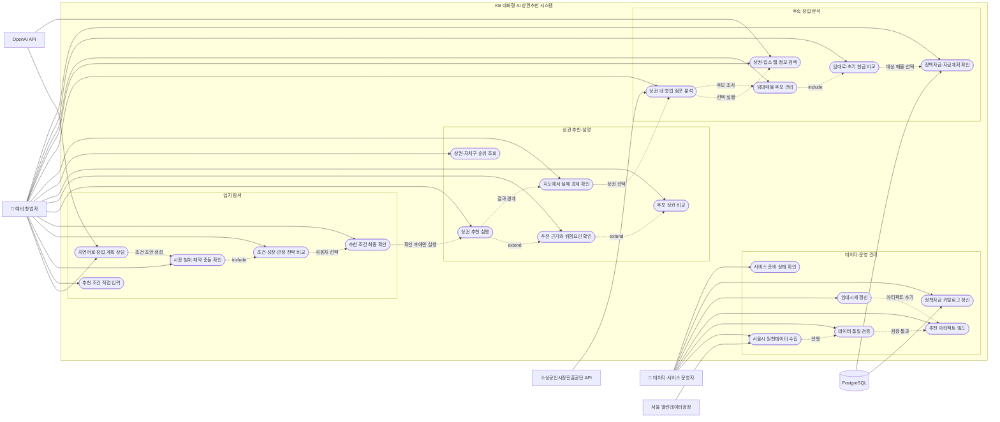
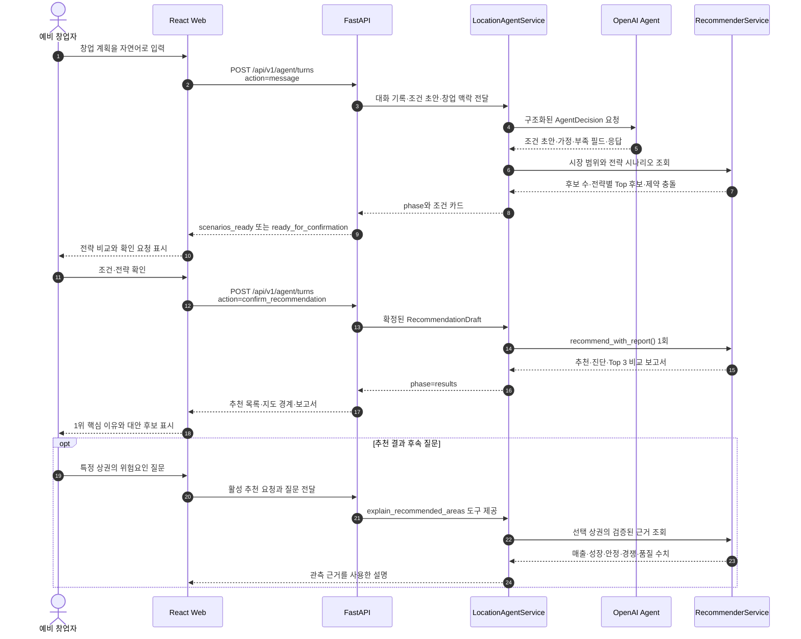
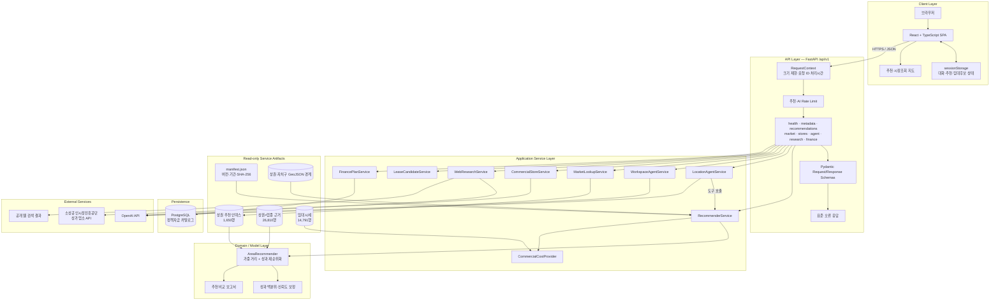
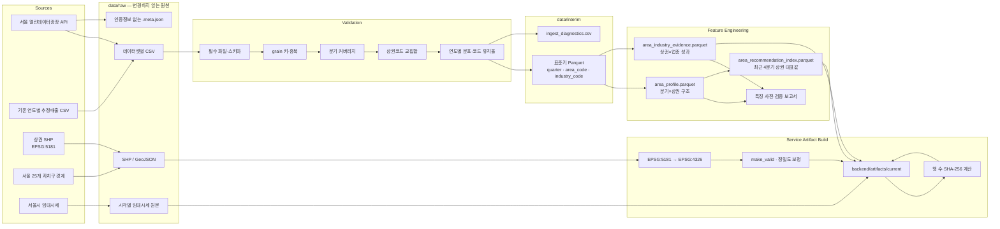
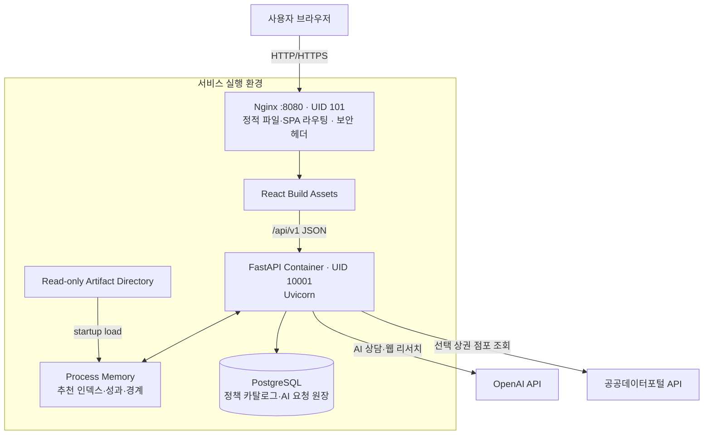
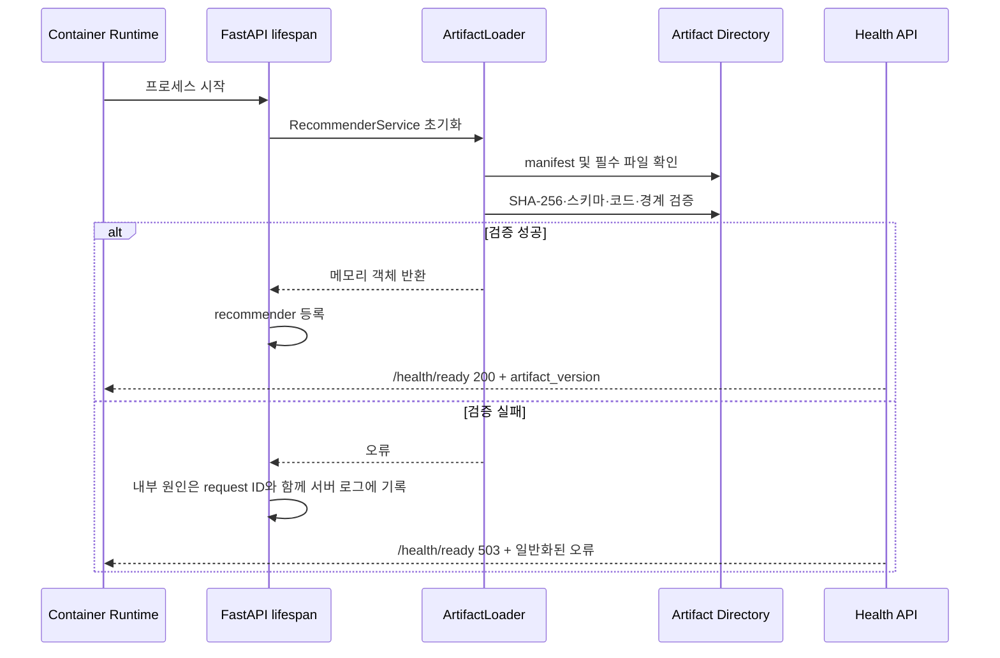
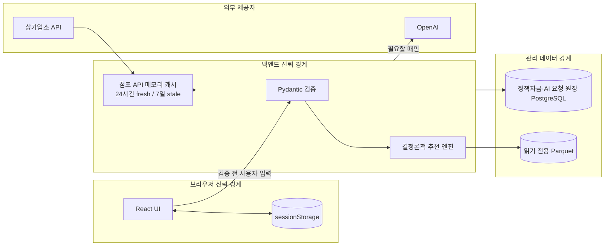

# KB AI Challenge — 유스케이스 및 시스템 아키텍처

> 이 문서는 [프로젝트 기술명세서](./project-technical-spec.md)를 보완하는 시각화 문서다.  
> 다이어그램은 현재 저장소의 FastAPI, React, 추천 아티팩트 및 AI 상담 구현을 기준으로 작성했다.

## 1. 시스템 경계

서비스의 핵심 사용자는 서울에서 창업 입지를 탐색하는 예비 창업자다. 사용자는 웹 화면 또는 API를 통해 조건을 입력하고, AI와 상담하거나 결정론적 추천 엔진을 직접 호출할 수 있다.

외부 시스템은 다음 네 종류로 구분한다.

- 서울 열린데이터광장: 상권 구조·매출·인구·점포·시설 데이터 수집
- 공공데이터포털 소상공인시장진흥공단 API: 선택 상권 안의 현재 영업 점포 조회
- OpenAI API: 자연어 상담, 추천 결과 설명, 사용자 요청 시 웹 리서치
- PostgreSQL: 정책자금 카탈로그 저장과 금융계획 조회

추천 모델 자체는 운영 요청 중 외부 API나 데이터베이스를 호출하지 않는다. 빌드 시점에 생성한 Parquet 아티팩트를 메모리에 올려 사용한다.

---

## 2. 전체 유스케이스 다이어그램

Mermaid에는 UML 전용 유스케이스 문법이 없으므로, 액터와 시스템 경계를 flowchart로 표현했다. 타원형 노드는 사용자가 달성하려는 유스케이스를 의미한다.

### 2.1 주요 액터

| 액터 | 책임과 관심사 |
|---|---|
| 예비 창업자 | 조건 입력, 전략 선택, 추천 확인, 후보 비교, 점포·임대·자금 검토 |
| 데이터·서비스 운영자 | 원천 수집, 품질 보고서 검토, 아티팩트 빌드·배포, readiness 확인 |
| 서울 열린데이터광장 | 분기별 상권·매출·점포·인구·시설 원천 제공 |
| 소상공인시장진흥공단 API | 선택한 실제 상권 경계 안의 현재 영업 점포 제공 |
| OpenAI API | 자연어 상담과 사용자 요청에 의한 웹 리서치 수행 |
| PostgreSQL | 검수된 정책자금 카탈로그 영속화 |

### 2.2 핵심 유스케이스 명세

| ID | 유스케이스 | 선행 조건 | 정상 결과 | 주요 예외 |
|---|---|---|---|---|
| UC-01 | 자연어 창업 상담 | AI API 설정 | 조건 초안·가정·다음 질문 생성 | API 키 없음, 제한 시간 초과 |
| UC-02 | 추천 조건 직접 입력 | 유효한 업종코드 | 구조화된 추천 요청 생성 | 스키마 범위 위반, 없는 코드 |
| UC-03 | 전략 시나리오 비교 | 업종과 기본 조건 확보 | 조건·성장·안정 전략 결과 비교 | 적격 후보 부족 |
| UC-04 | 추천 조건 확인 | 실행 가능한 조건 초안 | 확정 요청으로 추천 엔진 1회 실행 | 잘못된 상담 상태 |
| UC-05 | 상권 추천 | 아티팩트 readiness 통과 | 순위·점수·근거·경계 반환 | 후보 없음, 아티팩트 오류 |
| UC-06 | 추천 결과 설명 | 활성 추천 결과 존재 | 관측 지표 기반 설명·비교 | 결과에 없는 상권 요청 |
| UC-07 | 상권 내 점포 조회 | 상권과 업종 선택, 외부 API 키 | 경계 내부 점포 분류·표시 | 외부 API 장애, 캐시 없음 |
| UC-08 | 웹 리서치 | 사용자가 명시적으로 실행 | 검색 시각·출처 링크가 있는 요약 | AI API 장애·시간 초과 |
| UC-09 | 임대매물 비교 | 사용자가 찾은 매물 정보 | 보증금·월 임차비·권리금·첫해 현금 비교 | 필수 금액 누락 |
| UC-10 | 금융계획 | 분석할 임대 후보 선택 | 정책자금 후보와 자금계획 제공 | 카탈로그 DB 준비 실패 |
| UC-11 | 아티팩트 빌드 | 원천·processed 데이터 검증 통과 | 버전·체크섬이 있는 배포 묶음 생성 | 경계 불일치, 필수 컬럼 누락 |

---

## 3. 추천 상담 유스케이스 상세 흐름

### 3.1 성공 조건

- 추천 실행 전 사용자가 조건과 전략을 명시적으로 확인한다.
- AI가 아닌 `RecommenderService`가 점수와 순위를 계산한다.
- 응답은 실행한 아티팩트 버전과 실제 적용 가중치를 포함한다.
- 후속 설명은 현재 추천 결과와 관측 근거만 사용한다.
- 같은 아티팩트와 같은 요청은 같은 순위와 점수를 반환한다.

### 3.2 실패 및 대체 흐름

| 상황 | 처리 |
|---|---|
| AI API 키 없음·외부 장애 | AI 상담은 503, 직접 추천 API는 계속 사용 가능 |
| AI 제한 시간 초과 | 504 `AGENT_TIMEOUT`; 추천 엔진 상태에는 영향 없음 |
| 후보가 0개 | 422 `NO_ELIGIBLE_CANDIDATES`; 제약 완화 선택지 제시 가능 |
| 사용자가 확인 없이 실행 요구 | 상담 상태를 유지하고 확인 가능한 조건 카드 제시 |
| 임대료 아티팩트 없음 | 기존 추천 유지, `budget_adjusted=false`와 원인 반환 |
| 점포 외부 API 장애 | 프로세스 내 7일 이내 stale 캐시가 있으면 경고와 함께 사용 |

---

## 4. 논리 시스템 아키텍처

### 4.1 계층별 책임

| 계층 | 핵심 책임 | 하지 않는 일 |
|---|---|---|
| Client | 사용자 입력, 상태 유지, 지도·보고서 표시 | 추천 점수 재계산 |
| API | 계약 검증, 의존성 주입, 오류·요청 추적 | 데이터 특징 생성 |
| Application Service | 도메인 호출 조정, 경계·임대료·보고서 결합 | AI가 만든 수치를 신뢰해 순위에 사용 |
| Domain/Model | 후보 필터, 조건점수, 성과점수, 신뢰도 보정 | 외부 API·DB 직접 호출 |
| Artifact | 검증된 정적 추천 데이터 제공 | 요청 시 원천 데이터 갱신 |
| External/Persistence | AI·점포·정책자금 부가기능 제공 | 핵심 추천 엔진의 필수 의존성 역할 |

---

## 5. 데이터 파이프라인 아키텍처

### 5.1 파이프라인 단계별 산출물

| 단계 | 입력 | 출력 | 실패 기준 |
|---|---|---|---|
| 수집 | 서울시 API·기존 CSV | `data/raw` | HTTP 오류, 응답 스키마 불일치 |
| 원천 검증 | raw CSV | 품질 보고서 | 필수 파일·키·분기 누락 |
| 표준화 | 원천 한글/API 컬럼 | `data/interim/*.parquet` | grain 키 중복, 타입 변환 실패 |
| 상권 프로필 | 인구·점포·시설·주거 | `area_profile.parquet` | 상권 마스터 불일치, 면적 오류 |
| 업종 근거 | 매출·점포·상권 프로필 | `area_industry_evidence.parquet` | 필수 성과 컬럼 누락 |
| 추천 인덱스 | 최근 구조 프로필 | 상권별 1행 인덱스 | 최근 4분기 누락, 매출 특징 유입 |
| 공간 빌드 | SHP·GeoJSON | WGS84 경계 Parquet | 코드 집합·도형 유효성 불일치 |
| 패키징 | 추천·경계·임대 데이터 | manifest 포함 아티팩트 | 행 수·체크섬 생성 실패 |

---

## 6. 배포 아키텍처

### 6.1 기동과 readiness

---

## 7. 신뢰 경계와 데이터 저장 위치

| 데이터 | 저장 위치 | 지속 범위 | 비고 |
|---|---|---|---|
| 대화 원문·추천 UI 상태 | 브라우저 `sessionStorage` | 브라우저 탭 | 서버 DB에 저장하지 않음 |
| 추천 구조·성과·경계 | Parquet 아티팩트 | 배포 버전 | 읽기 전용, 체크섬 검증 |
| 점포 API 응답 | 백엔드 메모리 캐시 | 프로세스 수명 | 24시간 fresh, 최대 7일 stale fallback |
| 웹 리서치 결과 | 브라우저 `sessionStorage` | 브라우저 탭 | 사용자가 눌렀을 때만 실행 |
| 정책자금 카탈로그 | PostgreSQL | 영구 | preview·검증 후 반영 |
| AI 요청 제한 원장 | PostgreSQL | 일일 집계·실행 lease | 전역 요청·비용·동시 실행 제한, 대화 원문 미저장 |
| Agents SDK 응답 저장·추적 | 사용하지 않음 | 해당 없음 | `store=False`, tracing 비활성화 |

---

## 8. 다이어그램 해석 요약

1. **데이터 경로**는 수집 시점과 서비스 시점이 분리되어 있다. 운영 추천 요청은 서울시 API를 실시간 호출하지 않는다.
2. **추천 경로**는 Pydantic 검증을 거쳐 결정론적 모델로 들어가며 AI가 점수 계산에 참여하지 않는다.
3. **AI 경로**는 자연어 조건 수집과 결과 설명을 담당하고, 사용자 확인 후 검증된 추천 도구만 호출한다.
4. **부가기능 경로**는 점포·웹 리서치·금융지원으로 나뉘며 외부 서비스 장애가 핵심 추천 엔진으로 전파되지 않도록 분리되어 있다.
5. **운영 경로**는 manifest, SHA-256, readiness를 통해 잘못된 데이터 묶음으로 서비스가 시작되는 것을 차단한다.
